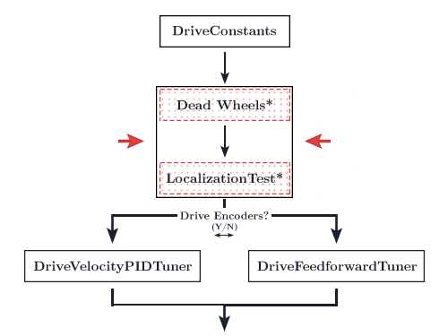
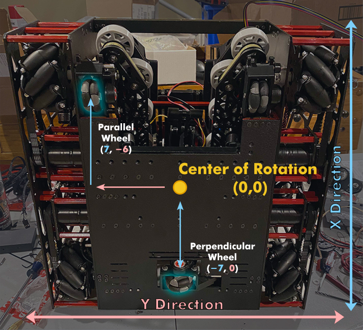
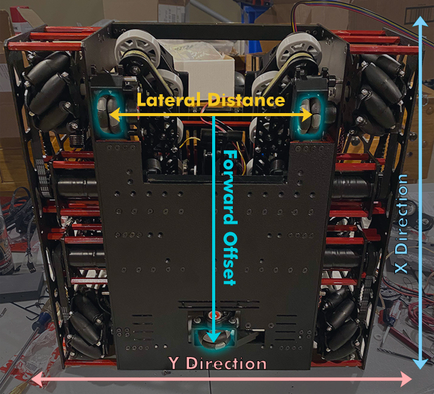

---
meta:
  - description: Configure and tune your dead wheels
---

# Dead Wheels

::: warning
If you are not using dead wheels, skip this section.
:::

<figure align="center">
    
    <figcaption class="mt-2 text-gray-600 text-center">You are here</figcaption>
</figure>

Your configuration will depend on whether you have two or three dead wheels. Don't know the difference? Check [the FAQ](/#what-is-the-difference-between-two-and-three-wheel-odometry).

If you're using a two-wheel setup, read only the [two-wheel odometry section](#two-wheel-odometry).

If you're using a three-wheel setup, read only the [three-wheel odometry section](#three-wheel-odometry).

## Two-Wheel Odometry

If you opt for the two wheel configuration, you will be using a gyroscope of your choice as the source for your heading. By default, you will be using the REV Hub's internal BNO055 gyroscope.

Feel free to use your own gyroscope. Simply declare it in `SampleMecanumDrive.java` and override the `getRawExternalHeading()` function.

Download [this file](https://github.com/NoahBres/road-runner-quickstart/blob/master/TeamCode/src/main/java/org/firstinspires/ftc/teamcode/drive/TwoWheelTrackingLocalizer.java) and stick it in your `TeamCode` folder, preferably next to the `StandardTrackingWheelLocalizer.java` file just for organizational purposes.

Open the `TwoWheelTrackingLocalizer.java` file (that you just downloaded) to edit.

### Ticks Per Rev/Wheel Radius/Gear Ratio

```java
/* Lines 37-39 in TwoWheelTrackingLocalizer.java */
public static double TICKS_PER_REV = 0;
public static double WHEEL_RADIUS = 2; // in
public static double GEAR_RATIO = 1; // output (wheel) speed / input (encoder) speed
```

**`TICKS_PER_REV`** is the number of "ticks" the encoders will count per revolution. You will find the specs of your encoders on your manufacturer's site. Be sure to find the `Counts Per Revolution` or `CPR`. The REV Through Bore Encoder has a `TICKS_PER_REV` of `8192`.

**`WHEEL_RADIUS`** is the radius of the dead wheel. Make sure this is the radius, not diameter.

**`GEAR_RATIO`** is the ratio of the output (wheel) speed to input (encoder) speed. If you are not gearing you encoders, leave this at 1.

### Parallel/Perpendicular X/Y

```java
/* Lines 41-45 in TwoWheelTrackingLocalizer.java */
public static double PARALLEL_X = 0; // X is the forward and back direction
public static double PARALLEL_Y = 0; // Y is the strafe direction

public static double PERPENDICULAR_X = 0; // X is the forward and back direction
public static double PERPENDICULAR_Y = 0; // Y is the strafe direction
```

Put in the X/Y coordinates of your perpendicular and parallel wheels. Remember that the X axis is the forward/back direction and the Y axis is the left/right direction. This is fairly standard for robotics/aviation/etc.

<figure align="center">
    
    <figcaption class="mt-2 text-sm text-gray-600 text-center">17508 Rising Tau's 2019/20 Skystone Bot</figcaption>
</figure>

### Encoder Directions

Make sure to reverse the encoder directions when appropriate.

E.g.

```java{7-9}
/* Lines 60-63~ in TwoWheelTrackingLocalizer.java */
parallelEncoder = new Encoder(hardwareMap.get(DcMotorEx.class, "parallelEncoder"));
perpendicularEncoder = new Encoder(hardwareMap.get(DcMotorEx.class, "perpendicularEncoder"));

// TODO: reverse any encoders using Encoder.setDirection(Encoder.Direction.REVERSE)

// If you need to reverse the perpendicular encoder:
// Vice-versa for the other encoder
perpendicularEncoder.setDirection(Encoder.Direction.REVERSE);
```

### Troubleshoot Encoder Directions

- Bot on the graph spins while the actual bot is going straight

  - Your perpendicular encoder is reversed

- Bot on the graph strafes the opposite way

  - Parallel encoder is reversed

::: danger
If you are using the Rev Through Bore encoders, please read the following section
:::

If your encoder velocity exceeds 32767 counts per second, it will cause an integer overflow when calling `getVelocity()`. This is because the Rev Hub firmware sends the velocity data using 16 bit signed integers rather than 32 bit. Due to the Rev Through Bore encoders' absurdly high CPR, this happens at around 4 rounds per second. Or only 25 inches per second with 2 inch diameter wheels.

Change the `getRawVelocity()` functions to `getCorrectedVelocity()` in the `getWheelVelocities()` function to fix this integer overflow:

```java{8-9}
/* Lines 86-95 in TwoWheelLocalizer.java */
public List<Double> getWheelVelocities() {
    // TODO: If your encoder velocity can exceed 32767 counts / second (such as the REV Through Bore and other
    //  competing magnetic encoders), change Encoder.getRawVelocity() to Encoder.getCorrectedVelocity() to enable a
    //  compensation method

    return Arrays.asList(
            encoderTicksToInches(parallelEncoder.getCorrectedVelocity()),
            encoderTicksToInches(perpendicularEncoder.getCorrectedVelocity())
    );
}
```

### Hardware ID's

```java
/* Lines 60-61 in TwoWheelTrackingLocalizer.java */
parallelEncoder = new Encoder(hardwareMap.get(DcMotorEx.class, "parallelEncoder"));
perpendicularEncoder = new Encoder(hardwareMap.get(DcMotorEx.class, "perpendicularEncoder"));
```

Ensure that these ID's match up with your Rev Hub config ID's.

### IMU

```java
/* Lines 111-114 in SampleMecanumDrive.java */
imu = hardwareMap.get(BNO055IMU.class, "imu");
BNO055IMU.Parameters parameters = new BNO055IMU.Parameters();
parameters.angleUnit = BNO055IMU.AngleUnit.RADIANS;
imu.initialize(parameters);
```

Ensure that the IMU is initialitzed in the `SampleMecanumDrive.java` class. You shouldn't need to change anything if you downloaded the quickstart and are using the Rev Hub IMU. This section should be changed if you are using your own external gyro.

### Set Localizer in SampleMecanumDrive

After you've configured your localizer, go back to the `SampleMecanumDrive.java` file.

Look at about line 145. You should find a comment stating "`// TODO: if desired, use setLocalizer() to change the localization method`"

Under this comment, add the following line:

```java{6}
/* About line 145 in SampleMecanumDrive.java */

// TODO: if desired, use setLocalizer() to change the localization method
// for instance, setLocalizer(new ThreeTrackingWheelLocalizer(...));

setLocalizer(new TwoWheelTrackingLocalizer(hardwareMap));
```

You have set the localizer!

<div class="h-16"></div>

## Three-Wheel Odometry

If you opt for the three wheel configuration, you will be using the two parallel wheels as the source for your heading.

Open up the `StandardTrackingWheelLocalizer.java` file.

### Ticks Per Rev/Wheel Radius/Gear Ratio

```java
/* Lines 30-32 in StandardTrackingWheelLocalizer.java */
public static double TICKS_PER_REV = 0;
public static double WHEEL_RADIUS = 2; // in
public static double GEAR_RATIO = 1; // output (wheel) speed / input (encoder) speed
```

**`TICKS_PER_REV`** is the number of "ticks" the encoders will count per revolution. You will find the specs of your encoders on your manufacturer's site. Be sure to find the `Counts Per Revolution` or `CPR`. The REV Through Bore Encoder has a `TICKS_PER_REV` of `8192`.

**`WHEEL_RADIUS`** is the radius of the dead wheel. Make sure this is the radius, not diameter.

**`GEAR_RATIO`** is the ratio of the output (wheel) speed to input (encoder) speed. If you are not gearing you encoders, leave this at 1.

### Lateral Distance/Forward Offset

```java
/* Lines 34-35 in StandardTrackingWheelLocalizer.java */
public static double LATERAL_DISTANCE = 10; // in; distance between the left and right wheels
public static double FORWARD_OFFSET = 4; // in; offset of the lateral wheel
```

**`LATERAL_DISTANCE`** is the distance from the left and right wheels.

**`FORWARD_OFFSET`** is the distance from the lateral wheel to the middle wheel. The `FORWARD_OFFSET` is positive when in front of the wheels and negative when behind the wheels (closer to the back).

<figure align="center">
    
    <figcaption class="mt-2 text-sm text-gray-600 text-center">17508 Rising Tau's 2019/20 Skystone Bot</figcaption>
</figure>

### Encoder Directions

Make sure to reverse the encoder directions when appropriate.

E.g.

```java{8-10}
/* Lines 46-63~ in StandardTrackingWheelLocalizer.java */
leftEncoder = new Encoder(hardwareMap.get(DcMotorEx.class, "leftEncoder"));
rightEncoder = new Encoder(hardwareMap.get(DcMotorEx.class, "rightEncoder"));
frontEncoder = new Encoder(hardwareMap.get(DcMotorEx.class, "frontEncoder"));

// TODO: reverse any encoders using Encoder.setDirection(Encoder.Direction.REVERSE)

// If you need to reverse the middle encoder:
// Vice-versa for the other encoders
frontEncoder.setDirection(Encoder.Direction.REVERSE);
```

### Troubleshoot Encoder Directions

- Bot on the graph spins while the actual bot is going straight

  - One of your parallel encoders is reversed

- Bot on the graph strafes the opposite way

  - Your middle encoder is reversed

- Your bot goes straight and strafes properly on the graph but turns the opposite way

  - Your left and right encoders are swapped

::: danger
If you are using the Rev Through Bore encoders, please read the following section
:::

If your encoder velocity exceeds 32767 counts per second, it will cause an integer overflow when calling `getVelocity()`. This is because the Rev Hub firmware sends the velocity data using 16 bit signed integers rather than 32 bit. Due to the Rev Through Bore encoders' absurdly high CPR, this happens at around 4 rounds per second. Or only 25 inches per second with 2 inch diameter wheels.

Change the `getRawVelocity()` functions to `getCorrectedVelocity()` in the `getWheelVelocities()` function to fix this integer overflow:

```java{8-10}
/* Lines 69-79 in StandardWheelLocalizer.java */
public List<Double> getWheelVelocities() {
    // TODO: If your encoder velocity can exceed 32767 counts / second (such as the REV Through Bore and other
    //  competing magnetic encoders), change Encoder.getRawVelocity() to Encoder.getCorrectedVelocity() to enable a
    //  compensation method

    return Arrays.asList(
            encoderTicksToInches(leftEncoder.getCorrectedVelocity()) * X_MULTIPLIER,
            encoderTicksToInches(rightEncoder.getCorrectedVelocity()) * X_MULTIPLIER,
            encoderTicksToInches(frontEncoder.getCorrectedVelocity()) * Y_MULTIPLIER
    );
}
```

### Set Localizer in SampleMecanumDrive

After you've configured your localizer, go back to the `SampleMecanumDrive.java` file.

Look at about line 145. You should find a comment stating "`// TODO: if desired, use setLocalizer() to change the localization method`"

Under this comment, add the following line:

```java{6}
/* About line 145 in SampleMecanumDrive.java */

// TODO: if desired, use setLocalizer() to change the localization method
// for instance, setLocalizer(new ThreeTrackingWheelLocalizer(...));

setLocalizer(new StandardTrackingWheelLocalizer(hardwareMap));
```

You have set the localizer!

<div class="h-16"></div>

## Tuning - Two-Wheel

Tuning your dead wheels is one of the most important steps along the entire tuning process. This is not constrained to Road Runner. Any time you choose to use Dead Wheels, whether it be in Road Runner, FTCLib, or your own home brew path following, your localization should be as accurate as possible.

### Adjusting the wheel radius

::: tip
This isn't quite necessary for everyone. You may choose to skip over this section. However, I did find that this process would increase localization accuracy by an additional 1% or so. 1% may not sound like much but over 100 inches that is an entire inch. During the FTC Skystone (2019-2020) season, a 4-5 stone autonomous programmed traveled well over 100 inches and an entire inch of extra accuracy may have made a big difference.
:::

1. First, open up the `TwoWheelTrackingLocalizer.java`
2. Declare two variables, `X_MULTIPLIER` and `Y_MULTIPLIER`, in your class:

```java
/* Lines 46-47 in TwoWheelTrackingLocalizer.java */
public static double X_MULTIPLIER = 1; // Multiplier in the X direction
public static double Y_MULTIPLIER = 1; // Multiplier in the Y direction
```

A finished example of where these go may be found [here](https://gist.github.com/NoahBres/02e83f8317f34d7b627170c2031b2ebf).

3. Add these mulitpliers to the `getWheelPositions()` function like so:

```java{5,6}
/* Lines 78-83 in TwoWheelTrackingLocalizer.java */
@Override
public List<Double> getWheelPositions() {
    return Arrays.asList(
            encoderTicksToInches(parallelEncoder.getCurrentPosition()) * X_MULTIPLIER,
            encoderTicksToInches(perpendicularEncoder.getCurrentPosition()) * Y_MULTIPLIER
    );
}
```

Remember that the X multiplier is on the parallel encoder because x faces forward for a local coordinate frame (common for robotics/aviation/etc situations).

4. You will begin the physical tuning process. Clear a straight line for your bot to travel in. I used a 90 inch stretch of field tiles.

5. Set your bot at the beginning of this stretch, facing forward.

6. Run the `LocalizationTest` opmode. Do not touch the controller.

7. Slowly drag your bot along this stretch. Keep the bot as straight as possible. I set a measuring tape below the entire stretch and kept the wheels as parallel as possible to this measuring tape.

8. Once you reach the end of your stretch, stop. Measure the distance traveled. Then look at the distance reported on the telemetry on the RC.

9. Your multiplier will be the `Measured Distance` / `Telemetry Distance Traveled` . For example, if your telemetry reports 89 inches but your tape measure reports 90 inches, your multiplier will be `1.01123596`.

10. I repeated this process 3 times for the forward direction to get the average multiplier. Then, set the `X_MULTIPLIER` to this value.

11. Repeat the same process but in the strafing direction.

12. Set `Y_MULTIPLIER` to the calculated strafe multiplier.

### Double Checking

We're going to double check that everything is hunky-dory with your localization.

1. Run the `LocalizationTest` opmode.

2. Navigate to `192.168.49.1:8080/dash` with a phone RC or `192.168.43.1:8080/dash` with a Control Hub.

3. Drive the bot around with your controller. You should see the bot being drawn on the graph in Dashboard. Make sure the drawn bot matches the movements of the actual bot.

4. The x coordinates on your bot should be increasing as you move forward. The y coordinates should be increasing as you strafe left. See the [coordinate system page](/trajectories.html#coordinate-system) for further details on why this is.

5. Check the troubleshooting section below if you encounter any issues.

<div class="h-16"></div>

## Tuning - Three-Wheel

Tuning your dead wheels is one of the most important steps along the entire tuning process. This is not constrained to Road Runner. Any time you choose to use Dead Wheels, whether it be in Road Runner, FTCLib, or your own home brew path following, your localization should be as accurate as possible.

### Adjusting the wheel radius

::: tip
This isn't quite necessary for everyone. You may choose to skip over this section. However, I did find that this process would increase localization accuracy by an additional 1% or so. 1% may not sound like much but over 100 inches that is an entire inch. During the FTC Skystone (2019-2020) season, a 4-5 stone autonomous programmed traveled well over 100 inches and an entire inch of extra accuracy may have made a big difference.
:::

1. First, open up the `StandardTrackingWheelLocalizer.java`
2. Declare two variables, `X_MULTIPLIER` and `Y_MULTIPLIER`, in your class:

```java
/* Lines 37-38 in StandardTrackingWheelLocalizer.java */
public static double X_MULTIPLIER = 1; // Multiplier in the X direction
public static double Y_MULTIPLIER = 1; // Multiplier in the Y direction
```

A finished example of where these go may be found [here](https://gist.github.com/NoahBres/9b9710eaa9f9fd23efa30a16de0f610e).

3. Add these mulitpliers to the `getWheelPositions()` function like so:

```java{5,6,7}
/* Lines 61-68 in StandardTrackingWheelLocalizer.java */
@Override
public List<Double> getWheelPositions() {
    return Arrays.asList(
            encoderTicksToInches(leftEncoder.getCurrentPosition()) * X_MULTIPLIER,
            encoderTicksToInches(rightEncoder.getCurrentPosition()) * X_MULTIPLIER,
            encoderTicksToInches(frontEncoder.getCurrentPosition()) * Y_MULTIPLIER
    );
}
```

Remember that the X multiplier is on the left/right because x faces forward for a local coordinate frame (common for robotics/aviation/etc situations).

4. You will begin the physical tuning process. Clear a straight line for your bot to travel in. I used a 90 inch stretch of field tiles.

5. Set your bot at the beginning of this stretch, facing forward.

6. Run the `LocalizationTest` opmode. Do not touch the controller.

7. Slowly drag your bot along this stretch. Keep the bot as straight as possible. I set a measuring tape below the entire stretch and kept the wheels as parallel as possible to this measuring tape.

8. Once you reach the end of your stretch, stop. Measure the distance traveled. Then look at the distance reported on the telemetry on the RC.

9. Your multiplier will be the `Measured Distance` / `Telemetry Distance Traveled` . For example, if your telemetry reports 89 inches but your tape measure reports 90 inches, your multiplier will be `1.01123596`.

10. I repeated this process 3 times for the forward direction to get the average multiplier. Then, set the `X_MULTIPLIER` to this value.

11. Repeat the same process but in the strafing direction.

12. Set `Y_MULTIPLIER` to the calculated strafe multiplier.

### Tuning the lateral distance

It is very important to tune lateral distance properly. This determines the heading in your localization and you will find that errors in your heading will quickly compound and absolutely destroy your localization.

Unfortunately, I can no longer recommend the automated tuning opmode. The original automated lateral distance tuner spun the bot around 10 times while measuring the angle from the IMU and localizer and calculating the effective lateral distance. However, multiple people have reported that the BNO055 IMU built into the Rev Hub does not provide accurate results and seems to be off by around 20 degrees by the end of these 10 turns. Therefore, I can no longer recommend using the IMU as a source of ground truth. We will have to manually tune the lateral distance.

1. The first step is to run the `LocalizationTest` opmode via the RC.

2. Then, connect to the RC phone's wifi network. The password to the network is located in the `Program and Manage` menu.

3. Navigate to `192.168.49.1:8080/dash` with a phone RC or `192.168.43.1:8080/dash` with a Control Hub.

4. Ensure that the field drawing is showing. If not, switch to field in the dropdown on the top right.

5. Stick a piece of tape or mark some spot with a sharpie on your bot and on the ground directly below that spot. Line these two up.

6. Spin your bot 10 rotations using the controller. Do not move the bot. Only spin it in place with the right joystick.

7. Watch the bot on the field as you do this. Make sure the heading doesn't lag behind or zoom ahead. The bot drawn in Dashboard and the real bot should be lined up. If the lateral distance is incorrect the bot in Dashboard will turn slower than your actual bot when lateral distance is too large or turn faster than your bot when lateral distance is too small.

8. On the last turn, slow down and make sure that the mark you made line up with each other to ensure that the turns is exactly 3600 degrees.

9. If the heading on the drawn field lags behind, slowly decrease the lateral distance. Or vice-versa.

10. Unfortunately, this is quite cumbersome but heading accuracy is quite important and this problem is not confined to Road Runner.

### Double Checking

We're going to double check that everything is hunky-dory with your localization.

1. Run the `LocalizationTest` opmode.

2. Navigate to `192.168.49.1:8080/dash` with a phone RC or `192.168.43.1:8080/dash` with a Control Hub.

3. Drive the bot around with your controller. You should see the bot being drawn on the graph in Dashboard. Make sure the drawn bot matches the movements of the actual bot.

4. The x coordinates on your bot should be increasing as you move forward. The y coordinates should be increasing as you strafe left. See the [coordinate system page](/trajectories.html#coordinate-system) for further details on why this is.

5. Check the troubleshooting section below if you encounter any issues.

### Deleting the IMU

The IMU does not serve a purpose in three wheel odometry. Thus, it would be ideal to get rid of the default initialization in `SampleMecanumDrive`. IMU initialization can add 2-3 seconds to the opmode initialization and it's quite annoying.

Open `SampleMecanumDrive.java` and delete this entire section:

```java
/* Lines 110-114 in SampleMecanumDrive.java */

// TODO: adjust the names of the following hardware devices to match your configuration
imu = hardwareMap.get(BNO055IMU.class, "imu");
BNO055IMU.Parameters parameters = new BNO055IMU.Parameters();
parameters.angleUnit = BNO055IMU.AngleUnit.RADIANS;
imu.initialize(parameters);
```

Just for safety reasons, replace the `getRawExternalHeading()` function return with zero:

```java{4}
/* Lines 349-352 in SampleMecanumDrive.java */
@Override
public double getRawExternalHeading() {
    return 0;
}
```

## Troubleshooting

- Bot on the dashboard field strafes the opposite direction as the actual bot

  - Reverse the direction of the perpendicular encoder

- Bot on the dashboard field doesn't spin in place properly

  - This is due to an offset center of rotation due to an incorrect perpendicular wheel placement. Tuning the position of your perpendicular wheel is a pain. It's fine to let this be a little inaccurate as an offset center of rotation will not affect the tracking accuracy. It will only introduce a little offset to your localization.

- Bot on the dashboard field spins while the actual bot is going straight

  - One of your parallel encoders are reversed

- Your bot on the dashboard field goes straight and strafes properly but turns the opposite way as the actual bot

  - Your left and right encoders are swapped

- The localization loses accuracy over a time/distance
  - First, try driving your bot around slowly. Attempt to minimize acceleration.
    - Does the localization remain accurate? If not, go back and double check your other properties. Check if heading is accurate. Check if the distance traveled during strafe and forward movements are accurate.
  - If the localization is fairly accurate at slow speeds but loses accuracy at high speeds, you are experiencing a hardware related problem.
  - The most likely issue is that your dead wheels do not have enough traction. Increase the spring force on your dead wheels.
