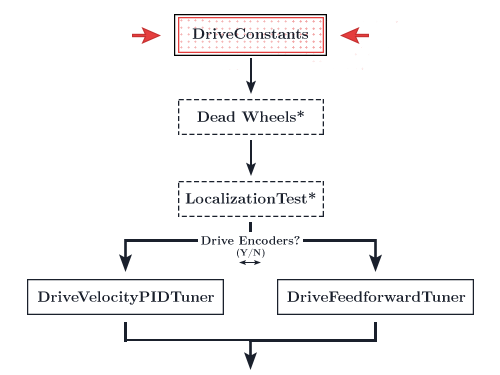
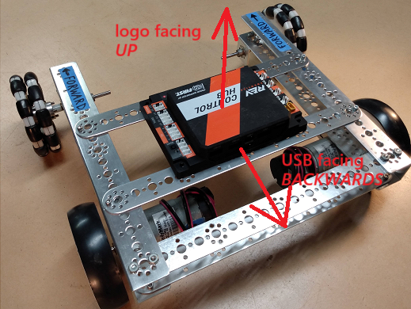
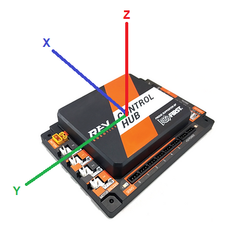
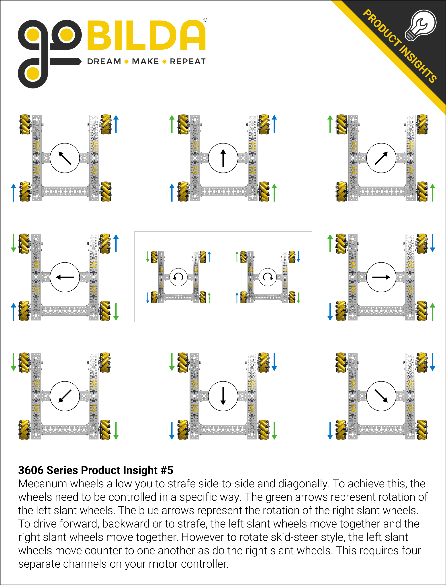

---
meta:
  - description: Configure your RoadRunner Drive Constants file
---

# Drive Constants

::: tip
Here is the drive constants file you will be editing.

[DriveConstants.java](https://github.com/acmerobotics/road-runner-quickstart/blob/quickstart1/TeamCode/src/main/java/org/firstinspires/ftc/teamcode/drive/DriveConstants.java)

If you haven't copied the file over to your own project yet, please do so!

Try out the configurator to have your constants class auto configured!

<p class="block md:hidden">
(The configurator is not available on mobile. Check it out on a desktop!)
</p>
:::

<div class="hidden md:block">
<ModalWrapper>
  <template v-slot:button="buttonSlotProps">
    <button class="block m-auto action-button" @click="buttonSlotProps.openModal">Configure Me!</button>
  </template>
  <template v-slot:modal="modalSlotProps">
    <Modal :isOpen="modalSlotProps.isOpen" :closeModal="modalSlotProps.closeModal">
      <DriveConstants-ConfigurationModal />
    </Modal>
  </template>
</ModalWrapper>
</div>

If you want to quickly get a constants file up and running, I recommend clicking the configurator button above to automatically generate your drive constants file. We will be going through what each constant means one by one below.

::: danger
If you choose to use the automatic configuration, you must add the IMU information into the file yourself, according to [this](/drive-constants.html#samplemecanumdrive-imu-velocity)
:::

<figure align = "center">
    
    <figcaption class="mt-2 text-center text-gray-600">You are here</figcaption>
</figure>

## Ticks Per Rev & Max RPM

```java
/* About lines 24-25 in DriveConstants.java */
public static final double TICKS_PER_REV = 1;
public static final double MAX_RPM = 1;
```

**`TICKS_PER_REV`** is the number of "ticks" the motors' encoders will count per revolution. You will find the specs of your drive train motors on the manufacturer's site. For goBILDA's 5202/5203/5204 motors, be sure to use the `Encoder Resolution` number listed in the "Specs" section on each motor's spec page, [found here](https://www.gobilda.com/yellow-jacket-planetary-gear-motors). For a few of the non-goBILDA motors, a list of relevant specs are listed below because the vendors do not make them obviously accessible on their own sites. Thank you goBILDA for being awesome.

<div class="flex justify-center">

| Motor                       | Ticks Per Rev | Max RPM |
| --------------------------- | :-----------: | ------: |
| REV HD Hex 40:1 Spur        |     1120      |     150 |
| REV HD Hex 20:1 Spur        |      560      |     300 |
| REV HD Hex 20:1 Planetary\* |     537.6     |   312.5 |
| NeveRest Classic 60         |     1680      |     105 |
| NeveRest Classic 40         |     1120      |     160 |
| NeveRest Orbital 20\*       |     537.6     |     349 |
| NeveRest Orbital 3.7        |     103.6     |    1780 |
| TETRIX TorqueNADO 60:1      |     1440      |     100 |
| TETRIX TorqueNADO 40:1      |      960      |     150 |
| TETRIX TorqueNADO 20:1      |      480      |     480 |

</div>

**`MAX_RPM`** is the maximum RPM that the motor can reach at the recommended voltage (12v).

\*Although these motors are labeled as having a 20:1 ratio they actually have a 19.2:1 ratio because they are planetary gears, thus the difference in speeds/ticks compared to the 20:1 spur motors.

## Run Using Encoder & Motor Velo PID

```java
/* About lines 35-37 in DriveConstants.java */
public static final boolean RUN_USING_ENCODER = true;
public static PIDFCoefficients MOTOR_VELO_PID = new PIDFCoefficients(0, 0, 0,
        getMotorVelocityF(MAX_RPM / 60 * TICKS_PER_REV));
```

**`RUN_USING_ENCODER`** indicates whether or not you want to utilize the `RUN_USING_ENCODER` [RunMode](https://gm0.org/en/stable/docs/software/using-the-sdk.html#dc-motor) built into the FTC SDK. This makes use of the onboard velocity PID, allowing you to control the motor via velocity rather than "power" (voltage). Setting this value to true will automatically set all the motors to use this velocity controlled mode. `RUN_USING_ENCODER` can only be utilized if you are using drive train encoders. Set this value to `false` if you are not using drive encoders.
::: warning
Since you should be using feedforward tunin instead of DeiveVelocityPID, this should stay set to false, even if you are using drive encoders
:::

**`MOTOR_VELO_PID`** will store the PID values you will use. The default SDK PIDF values are tuned based on the motors free-spinning without any load. The SDK's default values will be too low for a drive train. Thus, the quickstart sets these values at zero and we will tune them later.
::: warning
Once again, the recomended path is feedforward control, so you should not touch these values.
:::


## Wheel Radius/Gear Ratio/TrackWidth

```java
/* About lines 47-49 in DriveConstants.java */
public static double WHEEL_RADIUS = 2; // in
public static double GEAR_RATIO = 1; // output (wheel) speed / input (motor) speed
public static double TRACK_WIDTH = 1; // in
```

**`WHEEL_RADIUS`** is the radius of the wheels on your drive train. Make sure this is the radius, not diameter.

**`GEAR_RATIO`** is the ratio of the output (wheel) speed to input (motor) speed. If you are using direct drive—no gears/belts—`GEAR_RATIO` should be `1`. A gear ratio more than 1 will indicate that your wheel spins faster than your motor. A gear ratio less than one will indicate that your wheel spins slower than your motor. For example, the 2019 v1 goBILDA strafer kit includes a set of 1:2 bevel gears, reducing your output speed by half. So your gear ratio will be `1/2` or `0.5`.

::: warning
If you choose to set your gear ratio to a fraction, ensure that you use decimal values.

```java
// Don't do this
public static double GEAR_RATIO = 2 / 3;

// Do this
public static double GEAR_RATIO = 2.0 / 3.0;
```

This is due to the fact that the first case is actually an integer division. It results in an integer value of 0 then casts to a 0.0 double.
:::

**`TRACK_WIDTH`** is the distance from the center of one wheel to the center of its parallel wheel. This number only need be an estimate. You will empirically tune this later.

<figure align="center">
    
    <figcaption class="mt-2 text-sm text-center text-gray-600">3658 Bosons's 2019/20 Skystone Bot</figcaption>
</figure>

## kV/kA/kStatic

```java
/* About lines 57-59 in DriveConstants.java */
public static double kV = 1.0 / rpmToVelocity(MAX_RPM);
public static double kA = 0;
public static double kStatic = 0;
```

These are your feedforward gains used to model your drive motors. These will be tuned later if you opt for the feedforward method. Leave these variables as is.

**`kV`** Volts \* Seconds / Meters. The theoretical value of `kV` is 12 volts divided by the theoretical free speed of your drive train motors.

**`kA`** Volts \* Seconds^2 / Meters.

**`kStatic`** Volts.

Further details on the motor model can be found in [_Controls Engineering in FRC_ by Tyler Veness](https://file.tavsys.net/control/controls-engineering-in-frc.pdf). The effects of these constants will be explained later and are best understood through demonstration.


## Base Constraints

```java
/* About lines 68-71 in DriveConstants.java */
public static double MAX_VEL = 30;
public static double MAX_ACCEL = 30;
public static double MAX_ANG_VEL = Math.toRadians(180);
public static double MAX_ANG_ACCEL = Math.toRadians(180);
```

<div class="w-1 h-4"></div>

<span class="text-gray-800 bg-red-400 rounded" style="padding: 0.25rem 0.5rem;">**MAX_VEL**</span> defines the maximum velocity that the robot can go. This is the fastest speed that the robot can ramp up to. The default value is `30in/s`. You can calculate the theoretical maximum velocity for your bot using the following equation:

<figure align="center" class="py-10">
  
  <figcaption class="mt-4 text-sm text-center text-gray-600">Max Velocity Equation (per second)</figcaption>
</figure>

It is recommended that you keep your maximum velocity constraint not exceed 80% of the motors' max velocity. Your bot will most likely not be able to follow at 100% of the theoretical velocity due to a number of reasons: voltage dropping as your battery dies, weight, etc. You may push this limit closer to 100% but your trajectory following will suffer if your bot is not able to reach the given velocity.

The maximum velocity can be empirically defined using the `MaxVelocityTuner` opmode. It is still recommended that you set your `MAX_VEL` to 90-95% of the value that `MaxVelocityTuner` outputs.

<span class="text-gray-900 bg-yellow-300 rounded" style="padding: 0.25rem 0.5rem;">**MAX_ACCEL**</span> defines the maximum acceleration that the robot will undergo. This is the speed at which the velocity ramps up. The default value is `30in/s^2`. The recommendation is to just initially keep this value the same number as your max velocity value, although this is quite arbitrary. The only way to find your max acceleration is through experimentation. Keep raising the max acceleration until your path following starts to suffer. Do this after tuning just to make things easier. You may need to retune your PID values if you change this.

::: warning
There is an included MaxAngularVeloTuner OpMode in Roadrunner 0.5.6, but for some teams it seems to produce extremely low values (like 10 degrees per second) that are not their actual angular velocities. If this happens to you, use the default values or determine them through your own experimentation.
:::
<span class="text-gray-800 bg-purple-400 rounded" style="padding: 0.25rem 0.5rem;">**MAX_ANG_VEL**</span> defines the maximum angular velocity that the robot can go. This is the fastest speed that the robot can turn. The default value is `180°/s`. You can calculate the maximum angular velocity by dividing the maximum tangential velocity (max velo) by your track width. However, you should probably just leave this as is or determine the value through experimentation. Theoretical maximum angular acceleration doesn't match up well with the measured value.

<span class="text-gray-800 bg-orange-400 rounded" style="padding: 0.25rem 0.5rem;">**MAX_ANG_ACCEL**</span> defines the maximum angular acceleration that the robot can undergo. This is the fastest that the robot's angular velocity can ramp up. The default value is `180°/s^2`. This can only be found through tuning. However, it is a bit difficult to empirically determine this so just leave this as is.

## SampleMecanumDrive - Hardware ID's

Open your `SampleMecanumDrive.java` file.

```java
/* About lines 102-105 in SampleMecanumDrive.java */
leftFront = hardwareMap.get(DcMotorEx.class, "leftFront");
leftRear = hardwareMap.get(DcMotorEx.class, "leftRear");
rightRear = hardwareMap.get(DcMotorEx.class, "rightRear");
rightFront = hardwareMap.get(DcMotorEx.class, "rightFront");
```

Ensure that these motor ID's match up with your Rev Hub config ID's.

### SampleMecanumDrive - IMU Orientation

**_If you are using drive encoder localization_** (not dead wheels), in your drive constants, scroll to the `RevHubOrientationOnRobot` or add it if it is not there. It should resemble the code below. For further information on hub orientation setp, refer to the [FTC docs for the new Universal IMU interface](https://ftc-docs.firstinspires.org/en/latest/programming_resources/imu/imu.html).



```java
/* About line 76 in your DriveConstants.java. Add this if not present, and configure it yourself */
public static RevHubOrientationOnRobot.LogoFacingDirection LOGO_FACING_DIR =
        RevHubOrientationOnRobot.LogoFacingDirection.UP;
public static RevHubOrientationOnRobot.UsbFacingDirection USB_FACING_DIR =
        RevHubOrientationOnRobot.UsbFacingDirection.FORWARD;
```

## SampleMecanumDrive - IMU Velocity
**_If you are using drive encoder localization or two dead wheels**, in your `SampleMecanumDrive.java` file, scroll to the very bottom to find the `getExternalHeadingVelocity` function. Ensure that the function returns the axis that your IMU rotates about for your configuration. Consult the diagram below for a visual on which axis you should choose. If your REV Hub is mounted flat, the bot will rotate about the Z axis. If it is on its side with the motor ports facing up or down, the robot will rotate about the Y axis. If the servo ports are facing up or down, the bot will rotate about the x axis.
```java
/* About lines 296-299 in SampleMecanumDrive.java */
@Override
public Double getExternalHeadingVelocity() {
    return (double) imu.getRobotAngularVelocity(AngleUnit.RADIANS).zRotationRate;
}
```



## SampleMecanumDrive - Motor Direction

Then, look at lines 125-127. There should be a comment stating "`// TODO: reverse any motors using DcMotor.setDirection()`".
Under that comment, you will reverse the directions of the motors on one side of your bot. If your bot spins in circles during straight test, come back here to fix it. If your bot drives the opposite way, come back here to fix this. If your bot strafes the opposite direction, come back here to fix this. If your bot follows splines correctly but mirrored, your drive train right and left side motors are inverted. Refer to the goBILDA mecanum wheel direction chart below if you require help debugging your issue.

```java
/* About lines 125-127 in SampleMecanumDrive.java */

// TODO: reverse any motors using DcMotor.setDirection()
rightFront.setDirection(DcMotorSimple.Direction.REVERSE); // add if needed
rightRear.setDirection(DcMotorSimple.Direction.REVERSE); // add if needed
```

Refer to the [Motor Direction Debugger opmode](https://github.com/acmerobotics/road-runner-quickstart/blob/quickstart1/TeamCode/src/main/java/org/firstinspires/ftc/teamcode/drive/opmode/MotorDirectionDebugger.java) if you are struggling to debug your motor config. The Motor Direction Debugger allows you to run your motors one by one. Remove the `@Disabled` on line `41` and follow the directions in the opmode comments. Use this to diagnose your motor config problem and fix appropriately.


