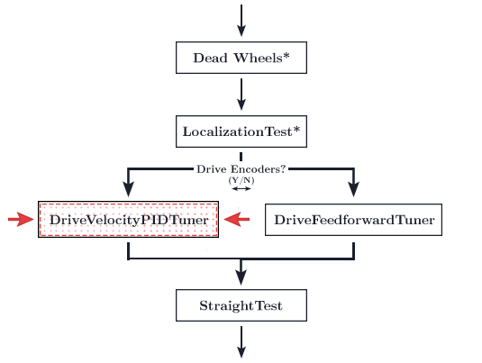
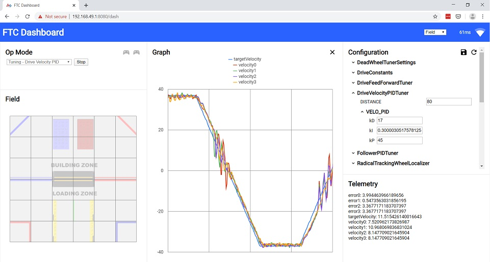

# Archive
These are archived pages and *should not be used* unless you really know what you are doing.

::: danger
DriveVelocityPID tuning is available only for archival reasons and ***should not be used on your robot***. Use [feedforward control](/feedforward-tuning.html) on your robot instead.
:::
## Why is DriveVelocityPID not used?
DriveVelocityPID uses the internal PID controller in the SDK, meaning that the tuning process is quite fickle. While you technically can achieve good results with this tuning method, using [feedforward](/feedforward-tuning.html) is much easier to tune and will result in the same accuracy. DriveVelocityControl can result in unfixable oscillation, especially once you integrate the heading and follower PIDs, and often takes much longer to tune even when you do not have issues.

## DriveVelocityPID tuning

<HideAyudeWrapper :skipIfDriveEncoders="true">
::: warning
This section should be skipped because you have chosen the option not to use drive encoders.
:::
</HideAyudeWrapper>

<figure align="center">
    
    <figcaption class="mt-2 text-gray-600 text-center">You are here</figcaption>
</figure>

Tuning the Velocity PID can be one of the more frustrating parts of Road Runner. This is required for accurate path following. However, intuition on how a PID controller works and what to do will help alleviate that frustration and hopefully make this a smooth process.

::: tip
You can press X (on the Xbox and Logitech gamepads, square on the PS4 dualshock) to pause the tuning process and enter driver control.

Press A (on the Xbox and Logitech gamepads, X on the PS4 dualshock) to cede control back to the tuner.

If your bot drifts off path, simply enter driver control and drive your bot back to the initial position.
:::

## Tuning

1. Before you begin tuning, start the RC phone and open up Dashboard. Connect to the RC phone's wifi network. The password to the network is located in the `Program and Manage` menu.

2. In your browser, navigate to `192.168.49.1:8080/dash` with a phone RC or `192.168.43.1:8080/dash` with a Control Hub.

3. Before you begin tuning the velocity PID opmode, we're going to run a quick tuner that gives us the empirical kF value and maximum velocity the bot can travel. Select the `MaxVelocityTuner`.

   - The `MaxVelocityTuner` will run at max speed for the specified `RUNTIME`. By default, the bot will run **full speed** for 2 seconds. **Ensure that you have enough room cleared for this!** You may adjust `RUNTIME` through the code or through Dashboard.

4. Run `MaxVelocityTuner`. After it has completed its sequence, it will print a "Max Velocity" value and a "Voltage Compensated kF" value.

   - "Max Velocity" is the maximum velocity your bot can travel while under load and at the battery level this opmode is ran at. You can use this value as your `MAX_VEL` in `DriveConstants`. It is recommended to set your `MAX_VEL` value to 90-95% of the number you just got, just to leave some leeway.
   - Take note of the `Voltage Comepnsated kF` value
   - If your `MaxVelocityTuner` spins in a circle, you have not reversed the motors on your drive train properly. Follow the directions [here](/drive-constants.html#samplemecanumdrive-motor-direction).

5. In Dashboard, look for the `DriveConstants` dropdown on the right. Press it and it should open a drop down. Then, look for the `MOTOR_VELO_PID` dropdown. Press that to open it. You should be presented with `p`, `i`, `d`, and `f` fields. Fill the `f` field in with the "Voltage Compensated kF" value from earlier.

6. Now, start up the `DriveVelocityPIDTuner` opmode. The bot will travel travel back and forth in a straight(ish) line over and over.
   - The default `DISTANCE` the bot travels is 72 inches. Therefore, ensure you have at least that specified distance's worth of clearance (plus another foot, ideally). You may adjust the `DISTANCE` value in the dashboard variable configuration sidebar or directly in the file itself if you do not have enough space. Although the bot is supposed to travel in a straight line, it will slowly drift to one side. This can be caused by a number of reasons from uneven weight distribution to the velocity PID simply being untuned. You need not worry about this as enabling the heading PID later will fix this during actual path following. I recommend clearing a space 2-3 field mats wide to help address the drift. If you have a path that is only 1 mat wide, it will keep falling off the edge and you need to keep resetting its position. If this happens, follow the tip at the top of the page and manually reset position via driver override.

Your page should look something like this:

<figure align="center">
    

      
      

    

    <figcaption class="mt-2 text-sm text-gray-600 text-center">Example dashboard (Ignore the graph content. This is just a sample of the page layout)</figcaption>
</figure>

7. Run the opmode. The graph will not show up until you have started it.

   - Remeber to turn off the 30 second autonomous timer!
   - Make sure to click the graph button _after_ you run the program. If the graph doesn't show up and instead shows a number of checkboxes, make sure you have clicked the `targetVelocity` and `velocity0` checkbox. Ignore the others. This will make tuning easier.

8. In the `DriveVelocityPIDTuner` dropdown, ensure that the `DISTANCE` variable is big enough so the `targetVelocity` line has a plateau. If it resembles a series of triangles, increase the `DISTANCE`. There should be a decently straight/flat portion in the graph, as shown in the sample dashboard above. This is so we can tune the behavior during the coasting phase as well.

9. Direct your attention back to the `MOTOR_VELO_PID` dropdown in the right sidebar from earlier. You will be tuning the PIDF gains found there.

10. At this point, once you have run the opmode, the bot should be moving back and forth along the distance specified in the opmode file. The goal of the tuning process is to match `velocity0` to the `targetVelocity` line. Edit the values in the text boxes and press enter. They will live update and you should see the effects take place on the bot.

11. **Recommended tuning process**:
    1. Set all the PID gains to zero. `f` should be set to the value we got earlier from `MaxVelocityTuner`.
    2. At this point, the `velocity0` line should be reaching to the top of the plateau. If it's overshooting (too high), lower the `kF` value. If our measured velocity does not reach the setpoint (`targetVelocity`), increase `kF`. However, the default `kF` value should be good enough.
    3. At this point, the top of your `velocity0` graph and the top of the `targetVelocity` graph should match. However, there should be a lot of "phase lag," where the accelerating/decelerating portions (the up/down slopes) lag behind the `targetVelocity`. Your graph is essentially out of phase. We will be raising the `p` value to try and minimize this phase lag.
    4. Slowly increase `p` to try and get the slopes to match the target.
    5. Increase `d` to try and dampen any oscillations. Increasing `d` too far will simply increase oscillations. You should really only need minor `d` adjustments.
    6. It is important to realize that raising `p` will only get you so far in reducing the phase lag. There will be a certain point where you can keep raising it and nothing really improves. You will just end up increasing oscillations and only marginally reducing the phase lag. This is due to the lack of `kA` adjustment in the REV Hub's internal motor controller. You must also realize that there will be a large bump on the deceleration portions of the graph. You cannot fix this. This is due to some quirks in the REV Hub's motor controller. Realizing the limitations of the internal PIDF controller is very important in keeping your sanity. There will be a constant small amount of phase lag no matter what you do and that's okay. Do not try and tune to perfection.
    7. You should not touch the `i` gain. The `i` gain tends to cause many problems and its use is technically incorrect. See the tip below.
    8. **Side Note:** The official Road Runner docs recommend that you should "prioritize eliminating phase lag even at the cost of some extra oscillations." However, I personally feel that it is better to try and minimize oscillations, especially towards the zero velocity (middle of the graph). I found that eliminating phase lag, especially at high speeds, would cause very jittery motion, most likely due to the Rev Hub's odd motor control. Hit us up in the [FTC Discord](https://discord.gg/first-tech-challenge) if you are interested in further technical details. My personal advice would be to try your best to minimize phase lag but if it causes your robot to visibly jitter, loosen up on the tuning and allow for the translational PID to fix any phase lag discrepancies.
    9. **Any adjustments in dashboard need to be copied over to the `DriveConstants.java` file under the equivalent variable name. Dashboard adjustments are temporary and will reset once you restart the opmode. Remember this!! It is very frustrating to get decent tunings and forgetting to save them in `DriveConstants.java`!**
    10. Check the tuning simulator to see how each gain affects the behavior.

::: tip
_"Velocity PID Controllers typically don't need `kD`"_ (Veness, Tyler. _Control Engineering in FRC_. pg. 17). However, it seems to be beneficial for FTC bots due to some feedforward and motor controller weirdness.

On a tangential note, you shouldn't need to use `i`.

> "Adding an integral gain to the controller is an incorrect way to eliminate steady-state error. A better approach would be to tune it with an integrator added to the plant, but this requires a model. Since we are doing output-based rather than model-based control, our only option is to add an integrator to the controller."

If you feel the need to add `i`, you should be increasing `f`.
:::

## Troubleshooting

1. Your `MaxVelocityTuner` is going backwards

   - Ensure that your wheel are reversed correctly. Check [the goBILDA mecanum chart](/drive-constants.html#samplemecanumdrive-motor-direction) to use as a reference while debugging

2. One of the velocity lines are going the opposite way and not following `targetVelocity`:

   - The polarity to the motors are reversed. The encoder is not reading the same direction as the motor is actually turning. Switch the black and red cable on your motor. Or, multiply the encoder readings in your `SampleMecanumDrive` by -1.

3. The StraightTest or DriveVelocityPID opmode keeps overshooting and tweaking variables in `DriveConstants.java` just doesn't change anything:

   - Try lowering the `MAX_VEL` in `DriveConstants.java`. Set it to a really low value at first to confirm that this is the problem.

4. Miscellaneous motor direction problems:
   - See [reversing motor directions](drive-constants.html#samplemecanumdrive-motor-direction)
   - Refer to the [Motor Direction Debugger opmode](https://github.com/acmerobotics/road-runner-quickstart/blob/quickstart1/TeamCode/src/main/java/org/firstinspires/ftc/teamcode/drive/opmode/MotorDirectionDebugger.java) if you are struggling to debug your motor config. The Motor Direction Debugger allows you to run your motors one by one. Remove the `@Disabled` lin on line `41` and follow the directions in the opmode comments. Use this to diagnose your motor config problem and fix appropriately.

## PID Tuning Simulator

<ClientOnly>
  <VeloPIDTuning-PIDTuningSimulator class="m-4" graphHeight="30rem" />
</ClientOnly>

Play around with the gains to see how each one affects the graph! Try and tune this simple example. This graph is very similar to what you will be doing while actually tuning the bot so having an understanding of how the process will go will be beneficial.

Tip: Press enter in the text input for your new gain to take effect (just like FTC-Dashboard!).

::: warning
This is a very very rudimentary "simulator." It is only meant to give you a basic high level understanding of how the gains affect the behavior of the graph. It is in no way trying to accurately simulate the Rev Hub's motor controller as that presents its own problems. This sim is based on a simple DC Motor model with arbitrary constants. The sim will not behave exactly like how your actual tuning will go but it is meant to give you a decent intuition of how it works. It's much easier than actual tuning as the kF value is very effective in the sim. Much less so on an actual bot due to the Rev Hub motor controller weirdness. Also, I am very aware of the bugs it has. That's what the "reset" button is for :P
:::

::: tip
Here are a few good videos on the topic of PID controllers. Highly recommend watching these as an intuitive understanding of the PID controller and the behavior of each gain will make tuning much easier.

The first video is very good in my opinion. You can skip the initial 3-4 minutes but the latter portion of the video goes over the behavior of each gain. The second video also does the same.

[https://www.youtube.com/watch?v=XfAt6hNV8XM](https://www.youtube.com/watch?v=XfAt6hNV8XM)

[https://www.youtube.com/watch?v=6OH-wOsVVjg](https://www.youtube.com/watch?v=6OH-wOsVVjg)

[https://www.youtube.com/watch?v=0vqWyramGy8](https://www.youtube.com/watch?v=0vqWyramGy8)

This article is also pretty neat:

[https://blog.wesleyac.com/posts/intro-to-control-part-one-pid](https://blog.wesleyac.com/posts/intro-to-control-part-one-pid)

:::

# Temporary Informal Video

Temporary informal video while the polished, edited videos are in production. Quality is atrocious but hopefully it helps :)

   <iframe width="560" height="315" src="https://www.youtube.com/embed/2UkeLsQuCOw" frameborder="0" allow="autoplay; encrypted-media" allowfullscreen></iframe>

