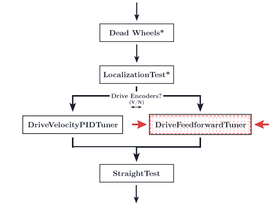
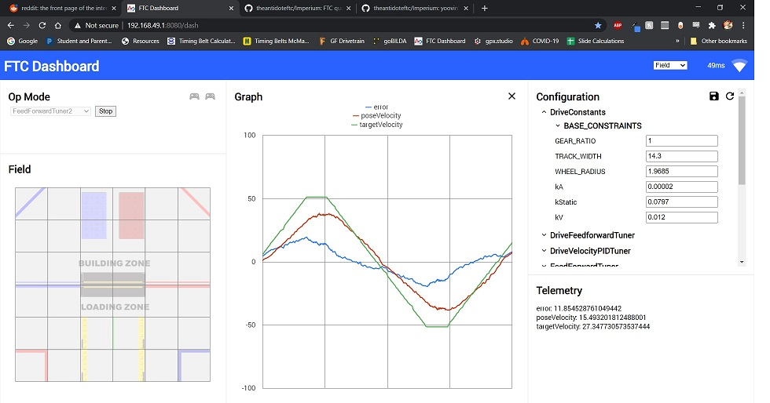
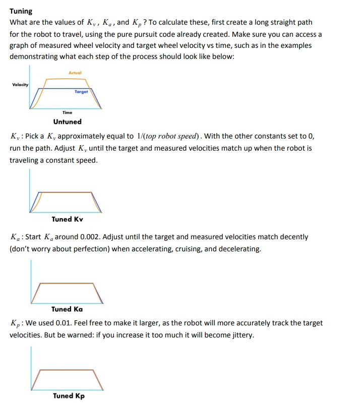
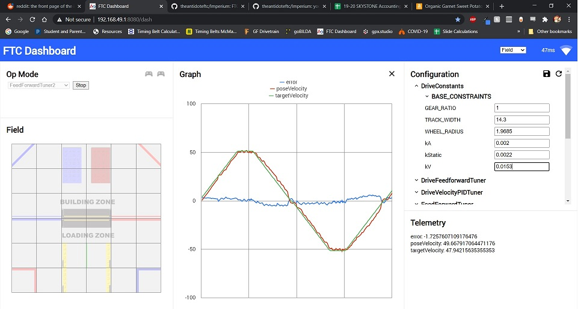

# Feedforward Tuning

<figure align="center">
    
    <figcaption class="mt-2 text-center text-gray-600">You are here</figcaption>
</figure>

Tuning the feedforward controller for accurate following is necessary for for accurate path following. Poor tuning of the feedforward controller will result in errors later along the line. Although the Road Runner quickstart comes with both an automatic tuner and a manual tuner, many find that the automatic tuner does not provide optimal results. The automatic tuner isn't able to properly calculate `kA`. However, you are free to try and run it and use the gains it produces. I would recommend manually tuning those results afterwards.

::: tip
You can press X (on the Xbox and Logitech gamepads, square on the PS4 dualshock) to pause the tuning process and enter driver control.

Press A (on the Xbox and Logitech gamepads, X on the PS4 dualshock) to cede control back to the tuner.

If your bot drifts off path, simply enter driver control and drive your bot back to the initial position.
:::

## Tuning
::: warning
It is likely that your robot will slowly drift off course throughout the tuning process, this is normal and will be fixed later during heading and translational pid tuning.
:::
1. The first step is to run the `ManualFeedforwardTuner` opmode via the RC.

2. Then, connect to the RC phone's wifi network. The password to the network is located in the `Program and Manage` menu.

3. Navigate to `192.168.49.1:8080/dash` with a phone RC or `192.168.43.1:8080/dash` with a Control Hub.

Your page should look something like this:

<figure align="center">
    

      
      

    

    <figcaption class="mt-2 text-sm text-center text-gray-600">Example dashboard (Ignore the graph content. This is just a sample of the page layout)</figcaption>
</figure>

4. Run the opmode. The graph will not show up until you have started it.

   - Make sure to click the graph button _after_ you run the program. If the graph still doesn't show up, and instead shows a number of checkboxes, that's okay. Click the `targetVelocity` and `poseVelocity` checkbox.

5. In Dashboard, look for the `DriveConstants` dropdown on the right. Press it and it should open a drop down. Then, look for the `kA`, `kV`, and `kStatic` variables. You will be tuning these in a second.

::: warning
This step is important. If you don't have a plateau, your kV is likely wrong and you will experience accuracy issues later. Increase distance until you have a relatively long velocity plateau on your graph.
:::
6. In the `ManualFeedforwardTuner` drop down, ensure that the `DISTANCE` variable is large enough so the `targetVelocity` line has a plateau. If it resembles a series of triangles, increase the `DISTANCE`.
::: tip
If you do not have enough distance, you can increase your `MAX_ACCEL` in drive constants (if your robot is capable of it) or lower `MAX_VEL` in drive constants. This will affect the speed/acceleration of trajectories, so beware.
:::

7. At this point, once you have run the opmode, the bot should be moving back and forth along the distance specified in the opmode file. The goal is for the `poseVelocity` line to match the `targetVelocity` line.

8. **Recommended tuning process**:

   1. `kV` should initially be set to `1 / max velocity`. The `poseVelocity` line should be touching the top of the `targetVelocity` plateau. If not, increase `kV`.
   2. Increase `kA`to try and get the slope of the `poseVelocity` line to match `targetVelocity`.
   3. Here is a reference to visualize what these gains should be doing.

      <figure align="center">
        

          
          

        

        <figcaption class="mt-2 text-sm text-center text-gray-600">Tuning Tips</figcaption>
      </figure>

      These tips come from FRC Team 1712's [Adaptive Pure Pursuit paper](https://www.chiefdelphi.com/t/paper-implementation-of-the-adaptive-pure-pursuit-controller/166552)

   4. That should be it! An example of a decently tuned feedforward controller can be found below.
   5. **Any adjustments in dashboard need to be copied over to the `DriveConstants.java` file under the equivalent variable name. Dashboard adjustments are temporary and will reset once you restart the opmode.**
   6. Check the tuning simulator to see how each gain affects the behavior.
   7. **Note:** The graph doesn't need to be perfect. Just "good enough." You can waste an infinite amount of time trying to perfect it. In addition to that, the Rev Hub's internal motor controller is a little odd and you will have a slight bump on deceleration that will be impossible to get rid of.

Decently tuned feedforward controller courtesy of Deetz from Team 14320:

<figure align="center">
  

    
    

    

  <figcaption class="mt-2 text-sm text-center text-gray-600">Tuned Feedforward Controller</figcaption>
</figure>

You may notice the asymmetry in the acceleration. Unfortunately, perfect velocity control is not yet achievable with a stock motor control model due to this asymmetry. Notice that the acceleration does not track well when decelerating. We suspect that this is due to weird Rev Hub's unique motor controller. For more details, or if you have a solution to this problem, please hit up the [FTC Discord](https://discord.gg/first-tech-challenge).

::: tip
The voltage that the REV Hub outputs will decrease as the battery level drops. Because of this, feedforward isn't guaranteed to be consistent throughout multiple matches. At this moment, Road Runner does not have explicit pose velocity closed loop control. There is a slight workaround to this. The translational PID controller's `kD` term is essentially equivalent to the `kP` term of a pose velocity PID controller. If you notice motion profile performance degradation along multiple matches, add a `kD` term to the translational PID (which you will tune in the [follower PID page](/follower-pid-tuning)). Further questions or don't quite understand this concept? Hit up the [FTC Discord](https://discord.gg/first-tech-challenge) and shoot a question in the programming channel!
:::

::: warning
As mentioned prior, the REV Hub's motor controller has issues decelerating properly. This makes it impossible to properly tune the feedforward on the deceleration phases (when the velocity moves toward zero). This causes an overshoot every time. If you seem to be exhibiting a 10% overshoot, that is to be expected from the poor deceleration. **Simply ignore it and move forward**. The follower PIDs will take care of the issue. Ensure that you set `kD` to a non-zero value in the follower PID tuning steps.
:::

## Troubleshooting

1. Your `MaxVelocityTuner` is going backwards

   - Ensure that your wheels are reversed correctly. Check [the goBILDA mecanum chart](/drive-constants.html#samplemecanumdrive-motor-direction) to use as a reference while debugging

2. The pose velocity line is going the opposite way and not following `targetVelocity`:

   - Your localization is bonked. Run `LocalizationTest` and ensure that the reported pose matches the bot's actual pose. Ensure that the `getWheelVelocities` function in your localizer (either in `SampleMecanumDrive` or the dead wheel localizers) match the signs in your `getWheelPositions` function.

3. The StraightTest or ManualFeedforwardTuning opmode keeps overshooting and tweaking variables in `DriveConstants.java` just doesn't change anything:

   - Try lowering the `MAX_VEL` in `DriveConstants.java`. Set it to a really low value at first to confirm that this is the problem.

4. Miscellaneous motor direction problems:
   - See [reversing motor directions](drive-constants.html#samplemecanumdrive-motor-direction)
   - Refer to the [Motor Direction Debugger opmode](https://github.com/acmerobotics/road-runner-quickstart/blob/quickstart1/TeamCode/src/main/java/org/firstinspires/ftc/teamcode/drive/opmode/MotorDirectionDebugger.java) if you are struggling to debug your motor config. The Motor Direction Debugger allows you to run your motors one by one. Remove the `@Disabled` lin on line `41` and follow the directions in the opmode comments. Use this to diagnose your motor config problem and fix appropriately.

## Feedforward Tuning Simulator

<ClientOnly>
  <FeedForwardTuning-FFTuningSimulator class="m-4" graphHeight="30rem" />
</ClientOnly>

Play around with the gains to see how each one affects the graph! Try and tune this simple example. This graph is very similar to what you will be doing while actually tuning the bot so having an understanding of how the process will go will be beneficial.

Tip: Press enter in the text input for your new gain to take effect (just like FTC-Dashboard!).

::: warning
This is a very very rudimentary "simulator." It is only meant to give you a basic high level understanding of how the gains affect the behavior of the graph. It is in no way trying to accurately simulate the Rev Hub's motor controller as that presents its own problems. This sim is based on a simple DC Motor model with arbitrary constants. The sim will not behave exactly like how your actual tuning will go but it is meant to give you a decent intuition of how it works. Also, I am very aware of the bugs it has. That's what the "reset" button is for :P
:::

# Temporary Informal Video

Temporary informal video while the polished, edited videos are in production. Quality is atrocious but hopefully it helps :)

   <iframe width="560" height="315" src="https://www.youtube.com/embed/efC0H9Twz_8" frameborder="0" allow="autoplay; encrypted-media" allowfullscreen></iframe>

