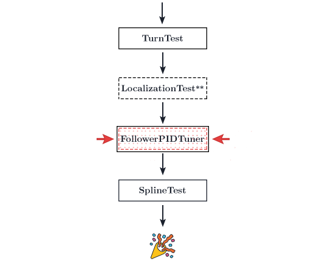

# Follower PID Tuning

<figure align="center">
    
    <figcaption class="mt-2 text-center text-gray-600">You are here</figcaption>
</figure>

This is the last tuning step. Here, you will tune the closed loop feedback controller. This should improve your path following dramatically.

There are two alternative opmodes for this process, `BackAndForth` or `FollowerPIDTuner`.

It is recommended to run the `BackAndForth` opmode to get a set of coarse PID gains and then run the same process using `FollowerPIDTuner` for further fine tuning.
The `BackAndForth` opmode simply travels in a straight line back and forth. It is easy to see major errors in translation and heading PID accumulate here.

The `FollowerPIDTuner` will follow a large square. The bot will turn _counterclockwise_ on each corner. If your heading is off, your entire square is destroyed and you have to keep resetting the bot. It's quite arduous. Use the `BackAndForth` opmode for initial tunings and then continue to further fine tune with `FollowerPIDTuner`.

1. Run the `BackAndForth` opmode via the RC.

2. Then, connect to the RC phone's wifi network. The password to the network is located in the `Program and Manage` menu.

3. Navigate to `192.168.49.1:8080/dash` with a phone RC or `192.168.43.1:8080/dash` with a Control Hub.

4. Ensure that you have the `Field` view selected in the top right.

5. You should see two lines and two circles being drawn: green for the target position and blue for your bot's actual position.

6. Look for the `SampleMecanumDrive` in the right sidebar. Open that dropdown. You should be seeing two options: `HEADING_PID` and `TRANSLATION_PID`. Both options are located in the `SampleMecanumDrive` file.

7. Open up `HEADING_PID` first. Just keep increasing `kP` until the robot starts to keep an accurate heading. This was around 8 in my experience, although your mileage may vary. You should not need to adjust `kD` and `kI`.

8. Open up `TRANSLATION_PID` next. Once again, keep increasing `kP` until the robot starts to adjust itself and follows the path. This was also around 8 in my experience, although your mileage may vary. You should not need to adjust `kD` and `kI`.

9. Once that's tuned, you should be done! Remember that any changes in Dashboard must be reflected in the appropriate file. So, you should copy-paste your numbers into the PID object in `SampleMecanumDrive.java`.

10. Feel free to run the same tuning process with `FollowerPIDTuner`. This is encouraged for further accuracy.

11. You should be done! Go on to the `SplineTest` to ensure that your following is accurate.

12. **Note:** Earlier I mentioned that you should not need to use `kI` or `kD` for your follower PID's. Those are just basic guidelines. `kD` actually indirectly functions as a P Controller on pose velocity. Therefore, setting `kD` to a non-zero value (1 or something), _IF you are using feedforward instead of velocity pid_, may help keep your pose velocity constant across battery voltages. _DO NOT_ set `kD` if you are using drive velocity PID as they will overlap and fight each other.

# Informal Video

This was originally meant to be temporary, but was never finished, so the quality is atrocious but hopefully it ends up helping :), it should explain well enough.

   <iframe width="560" height="315" src="https://www.youtube.com/embed/e6k_gP2YCmc" frameborder="0" allow="autoplay; encrypted-media" allowfullscreen></iframe>

