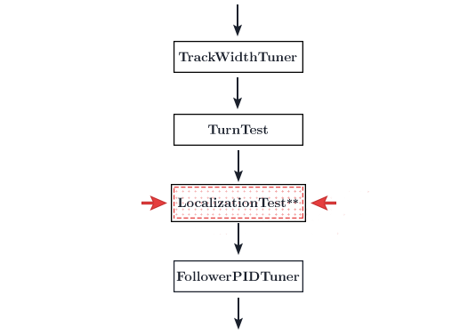

# Localization Test 2\*

<HideAyudeWrapper :skipIfDriveEncoders="true">
::: warning
This section should be skipped because you have chosen the option not to use drive encoders.
:::
</HideAyudeWrapper>

:::danger
If you're using dead wheels, ignore this page.
:::

<figure align="center">
    
    <figcaption class="mt-2 text-gray-600 text-center">You are here</figcaption>
</figure>

In this step, we are simply checking if the drive encoder localization proves to be accurate. Any errors in this step is due to an error in the `DriveConstants` file.

1. Run the `LocalizationTest` opmode via the RC.
2. Navigate to `192.168.49.1:8080/dash` with a phone RC or `192.168.43.1:8080/dash` with a Control Hub.
3. Ensure that you have the `Field` view selected in the top right.
4. Drive the bot around. You should see it being drawn on the map in Dashboard.
5. Ensure that the drawn bot matches the orientation of the actual bot.
6. If so, go ahead. If not, you will need to go back and fix a previous step.
