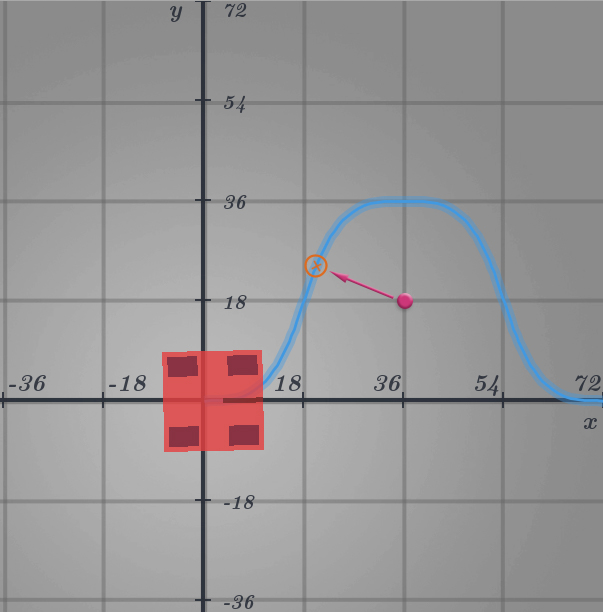

# Marker Guide

Alright so you got trajectories down. But you're in a robot competition and you're here to win! Your bot has to do more than simply drive around. You gotta turn on motors and lift servos and interact with elements. How do we accomplish that?

Road Runner as a handy little feature called markers. These allow you to run actions along your path.

Basic marker example:

<code-group>
<code-block title="Java" active>

```java{3-6}
drive.trajectoryBuilder(new Pose2d())
  .splineTo(new Vector2d(36, 36), Math.toRadians(0))
  .addDisplacementMarker(() -> {
    // Run your action in here!
    // Drop servo, start motor, whatever
  })
  .splineTo(new Vector2d(72, 0), Math.toRadians(0))
  .build();
```

</code-block>
<code-block title="Kotlin">

```kotlin{3-6}
drive.trajectoryBuilder(Pose2d())
  .splineTo(Vector2d(36.0, 36.0), Math.toRadians(0.0))
  .addDisplacementMarker {
    // Run your action in here!
    // Drop servo, start motor, whatever
  }
  .splineTo(Vector2d(72.0, 0.0), Math.toRadians(0.0))
  .build()
```

</code-block>
</code-group>

Pretty simple right?

## Types of Markers

There are 3 types of markers:

- Temporal Markers
- Spatial Markers
- Displacement Markers

## Temporal Markers - Basics

<code-group>
<code-block title="Java" active>

```java{4-8}
drive.trajectoryBuilder(new Pose2d())
  .splineTo(new Vector2d(36, 36), Math.toRadians(0))

  .addTemporalMarker(2, () -> {
      // This marker runs two seconds into the trajectory

      // Run your action in here!
  })

  .splineTo(new Vector2d(72, 0), Math.toRadians(0))
  .build();
```

</code-block>
<code-block title="Kotlin">

```kotlin{4-8}
drive.trajectoryBuilder(Pose2d())
  .splineTo(Vector2d(36.0, 36.0), Math.toRadians(0.0))

  .addTemporalMarker(2.0) {
      // This marker runs two seconds into the trajectory

      // Run your action in here!
  }

  .splineTo(Vector2d(72.0, 0.0), Math.toRadians(0.0))
  .build()
```

</code-block>
</code-group>

Temporal markers allow you to create an action based on the time elapsed. Keep in mind that temporal markers are evaluated "_globally_". This means that the marker is set after the entire trajectory is built. Because of this, it does not actually matter where you put the `addTemporalMarker` call. It will run the specified number of seconds into the trajectory, regardless of call order.

<code-group>
<code-block title="Java" active>

```java{6,13}
// Both of those trajectories run exactly the same,
// even though the add marker call is in a different order.

drive.trajectoryBuilder(new Pose2d())
  .splineTo(new Vector2d(36, 36), Math.toRadians(0))
  .addTemporalMarker(2, () -> {})
  .splineTo(new Vector2d(72, 0), Math.toRadians(0))
  .build();

drive.trajectoryBuilder(new Pose2d())
  .splineTo(new Vector2d(36, 36), Math.toRadians(0))
  .splineTo(new Vector2d(72, 0), Math.toRadians(0))
  .addTemporalMarker(2, () -> {})
  .build();
```

</code-block>
<code-block title="Kotlin">

```kotlin{6,13}
// Both of those trajectories run exactly the same,
// even though the add marker call is in a different order.

drive.trajectoryBuilder(Pose2d())
  .splineTo(new Vector2d(36.0, 36.0), Math.toRadians(0.0))
  .addTemporalMarker(2.0) { }
  .splineTo(new Vector2d(72.0, 0.0), Math.toRadians(0.0))
  .build()

drive.trajectoryBuilder(new Pose2d())
  .splineTo(new Vector2d(36.0, 36.0), Math.toRadians(0.0))
  .splineTo(new Vector2d(72.0, 0.0), Math.toRadians(0.0))
  .addTemporalMarker(2.0) { }
  .build()
```

</code-block>
</code-group>

## Displacement Markers - Basics

There are two basic ways to use displacement markers:

### Inline Displacement Markers

<code-group>
<code-block title="Java" active>

```java{4-8}
drive.trajectoryBuilder(new Pose2d())
  .splineTo(new Vector2d(36, 36), Math.toRadians(0))

  .addDisplacementMarker(() -> {
      // This marker runs after the first splineTo()

      // Run your action in here!
  })

  .splineTo(new Vector2d(72, 0), Math.toRadians(0))
  .build();
```

</code-block>
<code-block title="Kotlin">

```kotlin{4-8}
drive.trajectoryBuilder(Pose2d())
  .splineTo(Vector2d(36.0, 36.0), Math.toRadians(0.0))

  .addDisplacementMarker {
      // This marker runs after the first splineTo()

      // Run your action in here!
  }

  .splineTo(Vector2d(72.0, 0), Math.toRadians(0.0))
  .build()
```

</code-block>
</code-group>

This marker will run after the first `splineTo()`. It is not evaluated "_globally_" as mentioned before. The order matters. It will run after whatever command you specified before it. If you need a quick action right after a trajectory segment, use displacement. If you need to fine tune when your marker is called, global displacement markers will be the better option.

### Global Displacement Markers

<code-group>
<code-block title="Java" active>

```java{4-8}
drive.trajectoryBuilder(new Pose2d())
  .splineTo(new Vector2d(36, 36), Math.toRadians(0))

  .addDisplacementMarker(20, () -> {
      // This marker runs 20 inches into the trajectory

      // Run your action in here!
  })

  .splineTo(new Vector2d(72, 0), Math.toRadians(0))
  .build();
```

</code-block>
<code-block title="Kotlin">

```kotlin{4-8}
drive.trajectoryBuilder(Pose2d())
  .splineTo(Vector2d(36.0, 36.0), Math.toRadians(0.0))

  .addDisplacementMarker(20.0) {
      // This marker runs 20 inches into the trajectory

      // Run your action in here!
  }

  .splineTo(Vector2d(72.0, 0.0), Math.toRadians(0.0))
  .build()
```

</code-block>
</code-group>

This marker is based on _displacement_ (essentially distance traveled). This particular marker will be called once the bot has driven 20 inches. These displacement markers are evaluated "_globally_". Like the previous temporal marker example, it does not matter where you put the `addDisplacementMarker` call. It will run the specified displacement into the trajectory, regardless of call order.

<code-group>
<code-block title="Java" active>

```java{6,13}
// Both of those trajectories run exactly the same,
// even though the add marker call is in a different order.

drive.trajectoryBuilder(new Pose2d())
  .splineTo(new Vector2d(36, 36), Math.toRadians(0))
  .addDisplacementMarker(20, () -> {})
  .splineTo(new Vector2d(72, 0), Math.toRadians(0))
  .build();

drive.trajectoryBuilder(new Pose2d())
  .splineTo(new Vector2d(36, 36), Math.toRadians(0))
  .splineTo(new Vector2d(72, 0), Math.toRadians(0))
  .addDisplacementMarker(20, () -> {})
  .build();
```

</code-block>
<code-block title="Kotlin">

```kotlin{6,13}
// Both of those trajectories run exactly the same,
// even though the add marker call is in a different order.

drive.trajectoryBuilder(Pose2d())
  .splineTo(Vector2d(36.0, 36.0), Math.toRadians(0.0))
  .addDisplacementMarker(20.0) { }
  .splineTo(Vector2d(72.0, 0.0), Math.toRadians(0.0))
  .build()

drive.trajectoryBuilder(Pose2d())
  .splineTo(Vector2d(36.0, 36.0), Math.toRadians(0.0))
  .splineTo(Vector2d(72.0, 0.0), Math.toRadians(0.0))
  .addDisplacementMarker(20.0) { }
  .build()
```

</code-block>
</code-group>

## Spatial Markers - Basics

<code-group>
<code-block title="Java" active>

```java{4-8}
drive.trajectoryBuilder(new Pose2d())
  .splineTo(new Vector2d(36, 36), Math.toRadians(0))

  .addSpatialMarker(new Vector2d(20, 20), () -> {
      // This marker runs at the point that gets
      // closest to the (20, 20) coordinate

      // Run your action in here!
  })

  .splineTo(new Vector2d(72, 0), Math.toRadians(0))
  .build();
```

</code-block>
<code-block title="Kotlin">

```kotlin{4-8}
drive.trajectoryBuilder(Pose2d())
  .splineTo(Vector2d(36.0, 36.0), Math.toRadians(0.0))

  .addSpatialMarker(Vector2d(20.0, 20.0)) {
      // This marker runs at the point that gets
      // closest to the (20, 20) coordinate

      // Run your action in here!
  }

  .splineTo(Vector2d(72.0, 0.0), Math.toRadians(0.0))
  .build()
```

</code-block>
</code-group>

Spatial markers allow you to run an action based on a specified coordinate. This may be a bit unpredictable as Road Runner will project that coordinate you specified onto the path. This means that it will run at the point in the path closest to your specified coordinate. I personally don't recommend using spatial markers as they aren't very explicit.

<figure align="center">
    
    <figcaption class="mt-2 text-gray-600 text-center">Spatial marker being projected onto the path</figcaption>
</figure>

## Things to Keep In Mind

### All markers are time markers

Displacement markers and spatial markers are actually converted to time based markers internally once the trajectory is built. This means that Road Runner runs these markers based on a timer. This is actually quite reliable if your path following is accurate. If it is not, your marker calls may lag behind.

This also means that there is currently no path following markers, as paths aren't time based.

### Don't use `sleep()` in markers!

You may have used `sleep()` in a basic Linear OpMode to wait between actions. Say you drop a servo but it takes half a second to move and you don't want to call the successive action until that half a second is up. Or if you want to turn on a motor for a full second and turn it off. You might think to do the following:

<code-group>
<code-block title="Java" active>

```java
// THIS IS AN EXAMPLE OF WHAT NOT TO DO
drive.trajectoryBuilder(new Pose2d())
  .splineTo(new Vector2d(36, 36), Math.toRadians(0))
  .splineTo(new Vector2d(72, 0), Math.toRadians(0))
  .addDisplacementMarker(10, () -> {
    // Turn some motor and set it to 80% power
    motor1.setPower(0.8)

    // Sleep for 1500ms
    sleep(1500);

    // Turn off the motor
    motor1.setPower(0);
  })
  .build();
```

</code-block>
<code-block title="Kotlin">

```kotlin
// THIS IS AN EXAMPLE OF WHAT NOT TO DO
drive.trajectoryBuilder(Pose2d())
  .splineTo(Vector2d(36.0, 36.0), Math.toRadians(0.0))
  .splineTo(Vector2d(72.0, 0.0), Math.toRadians(0.0))
  .addDisplacementMarker(10.0) {
    // Turn some motor and set it to 80% power
    motor1.power = 0.8

    // Sleep for 1500ms
    sleep(1500.0)

    // Turn off the motor
    motor1.power = 0.0
  }
  .build()
```

</code-block>
</code-group>

This is bad. The `sleep()` function will pause the entire thread. This means that your code essentially "freezes" for that 1.5 seconds. Your bot can't make any adjustments to the speed or drive train in the background and the motion profile will fall apart.

I would recommend simply chaining two temporal markers or fine tuning multiple displacement markers instead.

<code-group>
<code-block title="Java" active>

```java
drive.trajectoryBuilder(new Pose2d())
  .splineTo(new Vector2d(36, 36), Math.toRadians(0))
  .splineTo(new Vector2d(72, 0), Math.toRadians(0))
  .addTemporalMarker(1, () -> {
    // Run action at 1 second into the path

    // Turn some motor and set it to 80% power
    motor1.setPower(0.8)
  })
  .addTemporalMarker(2.5, () -> {
    // Run action at 2.5 seconds into the path (1.5 seconds after the previous marker)

    // Turn off motor
    motor.setPower(0);
  })
  .build();
```

</code-block>
<code-block title="Kotlin">

```kotlin
drive.trajectoryBuilder(Pose2d())
  .splineTo(Vector2d(36.0, 36.0), Math.toRadians(0.0))
  .splineTo(Vector2d(72.0, 0.0), Math.toRadians(0.0))
  .addTemporalMarker(1.0) {
    // Run action at 1 second into the path

    // Turn some motor and set it to 80% power
    motor1.power = 0.8
  }
  .addTemporalMarker(2.5) {
    // Run action at 2.5 seconds into the path (1.5 seconds after the previous marker)

    // Turn off motor
    motor.power = 0
  }
  .build()
```

</code-block>
</code-group>

You can choose to make it fancier and abstract those times into a separate variable instead, like so:

<code-group>
<code-block title="Java" active>

```java
double setMotorTime = 1; // What time we set the motor power
double setMotorWait = 1.5; // How long we wait until we turn off the motor

drive.trajectoryBuilder(new Pose2d())
  .splineTo(new Vector2d(36, 36), Math.toRadians(0))
  .splineTo(new Vector2d(72, 0), Math.toRadians(0))
  .addTemporalMarker(setMotorTime, () -> {
    // Run action at 1 second into the path

    // Turn some motor and set it to 80% power
    motor1.setPower(0.8)
  })
  .addTemporalMarker(setMotorTime + setMotorWait, () -> {
    // Run action at 2.5 seconds into the path (1.5 seconds after the previous marker)

    // Turn off motor
    motor1.setPower(0);
  })
  .build();
```

</code-block>
<code-block title="Kotlin">

```kotlin
val setMotorTime = 1.0 // What time we set the motor power
val setMotorWait = 1.5 // How long we wait until we turn off the motor

drive.trajectoryBuilder(Pose2d())
  .splineTo(Vector2d(36.0, 36.0), Math.toRadians(0.0))
  .splineTo(Vector2d(72.0, 0.0), Math.toRadians(0.0))
  .addTemporalMarker(setMotorTime) {
    // Run action at 1 second into the path

    // Turn some motor and set it to 80% power
    motor1.power = 0.8
  }
  .addTemporalMarker(setMotorTime + setMotorWait) {
    // Run action at 2.5 seconds into the path (1.5 seconds after the previous marker)

    // Turn off motor
    motor1.power = 0.8
  }
  .build()
```

</code-block>
</code-group>

## Advanced Marker Use

The Road Runner marker api exposes some neat parameters that we can use to do some fancy stuff.

### Temporal Markers - Scale & Offset

```java
addTemporalMarker(scale: Double, offset: Double, callback: MarkerCallback)
```

Temporal markers are able to take a scale and offset.
Scale takes in a number from 0 to 1. This is the percentage of time in the entire path.
Offset takes in any arbitrary number used to offset that scale for fine tuning.

<code-group>
<code-block title="Java" active>

```java
.addTemporalMarker(0.5, 0.1, () -> {
  // This example will run 50% of the way through the path, plus 0.1 seconds
  // The offset can be left at zero but is useful for making slight adjustments to the timing
})
```

</code-block>
<code-block title="Kotlin">

```kotlin
.addTemporalMarker(0.5, 0.1) {
  // This example will run 50% of the way through the path, plus 0.1 seconds
  // The offset can be left at zero but is useful for making slight adjustments to the timing
}
```

</code-block>
</code-group>

### Temporal Markers - Lambda Parameter

<code-group>
<code-block title="Java" active>

```java
addTemporalMarker(pathTime -> pathTime * 0.3, () -> {
  // Runs 30% into the path
})
```

</code-block>
<code-block title="Kotlin">

```java
addTemporalMarker({ pathTime -> pathTime * 0.3 }) {
  // Runs 30% into the path
}
```

</code-block>
</code-group>

The first parameter takes a callback function that provides the total path time. This allows you to have explicit control over the path. You can return any number you want. The rest of the temporal markers are built on this function. It's not really recommended to use it yourself but the function is there in the event that you do want to.

### Displacement Markers - Scale & Offset

```java
addDisplacementMarker(scale: Double, offset: Double, callback: MarkerCallback)
```

Displacement markers are able to take a scale and offset.
Scale takes in a number from 0 to 1. This is the percentage of displacement of the entire path.
Offset takes in any arbitray number used to offset that scale for fine tuning.

<code-group>
<code-block title="Java" active>

```java
.addDisplacementMarker(0.5, 2.1, () -> {
  // This example will run 50% of the way through the path, plus 2.1 inches
  // The offset can be left at zero but is useful for making slight adjustments to the timing
})
```

</code-block>
<code-block title="Kotlin">

```kotlin
.addDisplacementMarker(0.5, 2.1) {
  // This example will run 50% of the way through the path, plus 2.1 inches
  // The offset can be left at zero but is useful for making slight adjustments to the timing
}
```

</code-block>
</code-group>

### Displacement Markers - Lambda Parameter

<code-group>
<code-block title="Java" active>

```java
.addDisplacementMarker(pathLength -> pathLength * 0.3, () -> {
  // Runs 30% into the path
})
```

</code-block>
<code-block title="Kotlin">

```kotlin
.addDisplacementMarker({ pathLength -> pathLength * 0.3 }) {
  // Runs 30% into the path
}
```

</code-block>
</code-group>

The first parameter takes a callback function that provides the total path length. This allows you to have explicit control over the path. You can return any number you want. The rest of the displacement markers are built on this function. It's not really recommended to use it yourself but the function is there in the event that you do want to.
