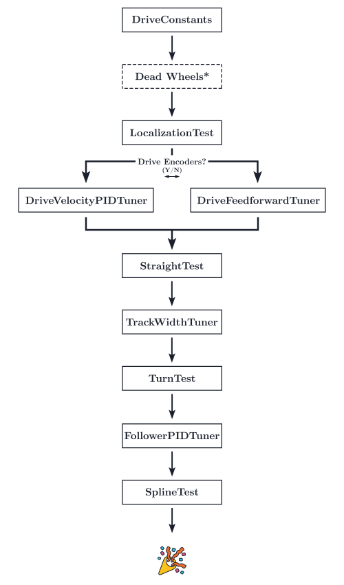

# High Level Overview

Before we get started, it's important to understand what everything is doing.

::: tip
This page roughly mirrors the tuning guide on Road Runner's official quickstart. Consider reading it for a more thorough overview.

[https://acme-robotics.gitbook.io/road-runner/quickstart/tuning](https://acme-robotics.gitbook.io/road-runner/quickstart/tuning)
:::

Road Runner handles all the fancy math to get everything up and running. However, you must tune everything so it handles as smooth as possible for your specific bot. Different bots with varying motors, weights, etc, all contribute to discrepancies in drive train behavior. Thus, one must follow the tuning guide to ensure that your drivetrain behavior is properly characterized.

::: warning
Significant changes to your bot (addition of a heavy mechanism, etc.) will necesitate a retuning. Although the tuning process should be much faster, this is recommended to ensures consistent behavior.
:::

<figure align="center">
    
    <figcaption style="marginTop: 1em;">These are the steps you will be following.</figcaption>
</figure>

**Please follow the guide _in order_, making sure that every step is completed before proceeding to the next.**

## Are You Using Drive Encoders?

Before you begin tuning, it is important to understand the difference between feedforward vs. PID velocity control and which one you are using. The goal of both of the systems is to reach and mantain a target velocity. The feedforward velocity control is an open loop system that will attempt to create a function translating voltage into velocity using specified drive characteristics. In contrast, the velocity PID is a closed loop system. It allows for live feedback and adjustment of the velocity using the readouts from an encoder. In general, a closed loop system will be most optimal. Thus, if you are able to, turn on `RUN_USING_ENCODERS` on each of your drive train motors to achieve the smoothest behavior. However, if you are using drive encoders with a three-wheel odometry setup (assuming 4x motors on the drive train), this will take up 7 out of your 8 available encoder slots leaving you with a single usable encoder slot for other robot mechanisms. This is not always possible and sacrificing your drive train encoders frees up 4 encoder slots. In this scenario, you would use the feedforward velocity control.

The tuning process will differ depending on which form of control you use.

<Ayude />

## Drive Constants

The drive constants file will include everything regarding the physical characteristics of the bot. This includes motors RPM, wheel radius, etc. Most errors in the drive manifest themselves in this stage. For example, if your robot is traveling half the distance specified, this is most likely a problem in your drive constants. Please check the [drive constants page](/drive-constants) page for further details.

## Localization Test

Bla bla bla

## DriveVelocityPIDTuner <SkipAyudeBadge :skipIfDriveEncoders="false" />

<HideAyudeWrapper :skipIfDriveEncoders="false">
::: warning
This section should be skipped because you have chosen the option not to use drive encoders.
:::
</HideAyudeWrapper>
blab la bla bla

## DriveFeedforwardTuner <SkipAyudeBadge :skipIfDriveEncoders="true" />

<HideAyudeWrapper :skipIfDriveEncoders="true">
::: warning
This section should be skipped because you have chosen the option to use drive encoders.
:::
</HideAyudeWrapper>
bla bla bla bla
