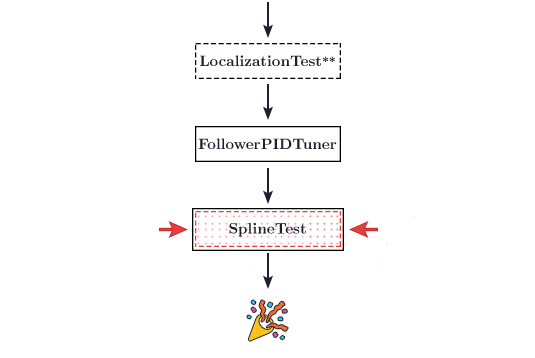

# Spline Test

<figure align="center">
    
    <figcaption class="mt-2 text-center text-gray-600">You are here</figcaption>
</figure>

1. Once your `TRANSLATION` and `HEADING` PID's are tuned, you should run the spline test to make sure everything is in order.
2. Open dashboard to make sure that it's following correctly. The bot should follow an S-shaped path and Dashboard should follow the path properly.
3. If your spline following seems to demonstrate slight oscillations, your p gain in either your velocity PID or your translational/heading PID is too high. You may want to go back to try and isolate this behavior.
4. If something goes wrong, try and go back to diagnose the problem. Hit up the [FTC Discord](https://discord.gg/first-tech-challenge) if you're stuck.

<ClientOnly>
  <div class="flex items-center justify-center">
    <HoverConfetti>🎊🎉🎊🎉 Congrats you're done! 🎊🎉🎊🎉</HoverConfetti>
  </div>
</ClientOnly>

## Diagnostic Tips

- Open up dashboard as your bot follows a path
  - Watch the x/y/heading error. Determine if the error is caused by the localizer or the base path follower.
- Turn off the translational/heading PID
  - Set the coefficients in translational/heading PID to zero
  - If your following is okay after turning off translational/heading PID, then the problem lies in the localizer
    - Run `LocalizationTest` and try to fix your localizer (most likely `StandardTrackingWheelLocalizer` if you're having issues as it's quite a fickle one)
  - If your following is not okay even after turning off the translation/heading PID, then the error lies in the drive train motor directions or the drive constants
- Work backwards and start turning things off to isolate the problem. Starting from scratch and working on each component, step by step, may lead to a faster solution
- You can turn off the pose history limit (you'll notice that the pose history, blue line, will start clearing itself on the dashboard field to keep everything clean) by setting `POSE_HISTORY_LIMIT` in `SampleMecanumDrive` to -1. This will stop the blue line from slowly clearing itself and may assist in debugging.
- Lower your velocity and acceleration constraints in `DriveConstants.java`. These constraints are meant to characterize your drive train. Specifying velocities and acceleration values that are higher than what your bot is actually able to achieve will result in motion profiles that are impossible to follow and ruin path following.
  - If you are having serious problems with your following, lower your maximum velocity and acceleration dramatically (just cut it in half) and set your angular velocity/acceleration to something low such as 60 degrees per second.

## Hiding the tuning opmodes

The Road Runner quickstart comes with many tuning opmodes. They can clutter up the RC's opmode list quite a bit, especially when you start adding many of your own opmodes. If you are finished with your tuning process, you can hide these opmodes using the `@Disabled` annotation on your opmodes.

Do so by inserting the following above any of the opmode class declarations:

```java{2}
@Config
@Disabled
@Autonomous(group = "drive")
public class DriveVelocityPIDTuner extends LinearOpMode {
    public static double DISTANCE = 72; // in
```
