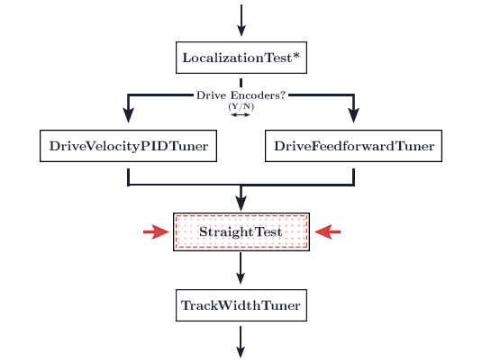

# Straight Test Tuning

<figure align="center">
    
    <figcaption class="mt-2 text-gray-600 text-center">You are here</figcaption>
</figure>

::: warning
If you are utilizing drive encoder localization (no dead wheels), you must follow the [drive encoder localization](#drive-encoder-localization) step below. This section is important for drive encoder localization tuning.
:::

Once you've got your velocity controller tuned, you should run a quick straight test just to make sure everything is working properly.

1. Run the `StraightTest` opmode via the RC.
2. Measure the distance the bot traveled.
3. The distance traveled should be 60 inches by default.
   - You can change this distance in Dashboard or through the opmode directly
     - If you'd like to change it in Dashboard, find the `StraightTest` dropdown in the variable configuration sidebar on the right. Change the `DISTANCE` value.
     - If you'd like to change it directly in the opmode, open the `StraightTest.java` file and change the `DISTANCE` variable on line 17.
4. Run the `StraightTest` opmode like 2 or 3 times to ensure that the distance traveled is consistent within 1-3% of your specified `DISTANCE`. If not, your velocity controller requires further tuning. It does not need to hit the _exact_ spot each time as you will later enable closed loop feedback using localization. We're looking for consistency in this step.

   - Your bot may drift a little to one side. Just ignore this for now. This will be corrected once the heading and translation PIDs are enabled in later steps.

::: danger

**IF YOU ARE USING FEEDFORWARD INSTEAD OF DRIVE VELOCITY PID**

There is a good chance that your bot will overshoot your specified distance by around 10-15%. This issue is exacerbated the faster your drive train. This is due to the REV Hub motor controller's poor deceleration control. You are free to ignore this problem at this step. Tuning the translational PID during the FollowerPID tuning phase will hopefully correct for this issue. `kD` will act as a P-controller for velocity thus curtail this issue somewhat. `kP` will hopefully further ameliorate this issue. However, if the translational PID does not entirely correct for this overshoot and causes oscillations towards the endpoints, it may be auspicious to reduce `kV` so that your bot does not overshoot. See the footnote at the bottom of the page for further information on this.

:::

5. If everything works great, move on to the next step!

## Tuning Lateral Multiplier - Dead Wheels

::: warning
Disregard this section if you are using drive encoder localization (no dead wheels).
:::

::: tip
This isn't absolutely necessary (if you are using dead wheels). However, due to the nature of mecanum kinematics, a mecanum drive does exhibit less torque while strafing. Thus, the feedforward may require some slight compensation. If you skip this step, the translational PID will most likely pick up any discrepancy and you may not notice it at all. However, if you do see some undershooting while strafing, you will be interested in applying a lateral multiplier.

See [this paper](https://www.chiefdelphi.com/t/paper-mecanum-and-omni-kinematic-and-force-analysis/106153) for more details on the strafing inefficiency.
:::

1. Run the `StrafeTest` opmode via the RC.
2. This opmode will strafe right at the specified distance. You are free to change the code to strafe left.
3. The distance traveled should be 60 inches by default. However, it may undershoot. If so, measure the distance traveled.
4. Take your target distance (60 inches by default) and divide it by the actual distance traveled.
5. Set your `LATERAL_MULTIPLIER` in `SampleMecanumDrive.java` (line 57) to this value.
6. Run the `StrafeTest` opmode again and now it should go the correct distance.

## Drive Encoder Localization

If you are using drive encoder localization (no dead wheels), you will need to tune your localization in the `StraightTest` and `StrafeTest` steps.

### Straight Test

- Run the `StraightTest` opmode. The opmode will print the x and y distance traveled once finished.
- Your bot may drift to one side. This will be fixed later once translational and heading PID is enabled.
- Measure how far your bot travels during the `StraightTest` (with a tape measure). Then compare the measured value with the telemetry's `finalX` value.
- If the reported `finalX` value does not match up with the measured distance, multiply `GEAR_RATIO` in `DriveConstants.java` (or in the variable sidebar for testing) by `measured distance / reported x value`.
- You may want to do this more than once to fine tune the localization. Even a 1% increase in accuracy makes a difference.

### Strafe Test

- Run the `StrafeTest` opmode. The opmode will print the x and y distance traveled once finished.
- Your bot may drift forward or back quite a bit. This will be fixed later once translational and heading PID is enabled.
- Measure how far your bot travels during the `StrafeTest` (with a tape measure). Then compare the measured value with the telemetry's `finalY` value.
- If the reported `finalY` value does not match up with the measured distance, set the `LATERAL_MULTIPLIER` variable in `SampleMecanumDrive.java` (or in the variable sidebar for testing) to `reported y value / measured distance`.
- You may want to do this more than once to fine tune the localization. Even a 1% increase in accuracy makes a difference.

## Troubleshooting

### Does your straight test go backwards or turn in a circle?

Reverse your motor directions. Instructions on where to do this can be found [here](/drive-constants.html#samplemecanumdrive-motor-direction).

### **Is your straight test consistent but it doesn't travel the specified distance?**

Check your `DriveConstants.java` file. Something went wrong in here. One of these constants may be directly related to the problem:

- `TICKS_PER_REV` - check the encoder ticks and make sure that it corresponds with the spec sheet

- `MAX_RPM` - check the max rpm and make sure that it corresponds with your motor's specced rpm

- `WHEEL_RADIUS` - this should match your drive train's wheel radius. Make sure this isn't diameter

- `GEAR_RATIO` - if this is 1:1 dont worry about it. Make sure your ratio is output:input instead of reversed

### Does your bot strafe the wrong direction?

Your top and bottom motors are reversed. Ensure that your bot's motors follow the directions specified in goBILDA's wheel direction chart. Problems with strafing or turning direction are originated in a broken motor configuration (your motors aren't plugged into the specificed port, etc).

Refer to the [Motor Direction Debugger opmode](https://github.com/acmerobotics/road-runner-quickstart/blob/quickstart1/TeamCode/src/main/java/org/firstinspires/ftc/teamcode/drive/opmode/MotorDirectionDebugger.java) if you are struggling to debug your motor config. The Motor Direction Debugger allows you to run your motors one by one. Remove the `@Disabled` lin on line `41` and follow the directions in the opmode comments. Use this to diagnose your motor config problem and fix appropriately.

### Constant ~10% Overshoot

As mentioned prior, the REV Hub's motor controller has issues decelerating properly. This makes it impossible to properly tune the feedforward on the deceleration phases (when the velocity moves toward zero). This causes an overshoot every time. If you seem to be exhibiting a 10% overshoot, that is to be expected from the poor deceleration. **Simply ignore it and move forward**. The follower PIDs will take care of the issue. Ensure that you set `kD` to a non-zero value in the follower PID tuning steps.

::: tip

On reducing `kV` to reduce overshoot: This will be detrimental to the extent of which your bot is able to accurately follow the specified motion profiles. However, we may excuse this imprecision through the justification that endpoint following accuracy is more relevant than the accuracy of following during the rest of the path. We are hoping that the closed loop feedback will fix any issues during the rest of the following. Reducing `kV` to offset this overshoot will affect the rest of the motion profile accuracy, especially the coasting phase. However, chances are with the fast ratios that this issue tends to be prevalent in, you're not actually spending a significant amount of time coasting. Thus the acceleration/deceleration phases are more important. So reducing `kV` should be fine.

:::
