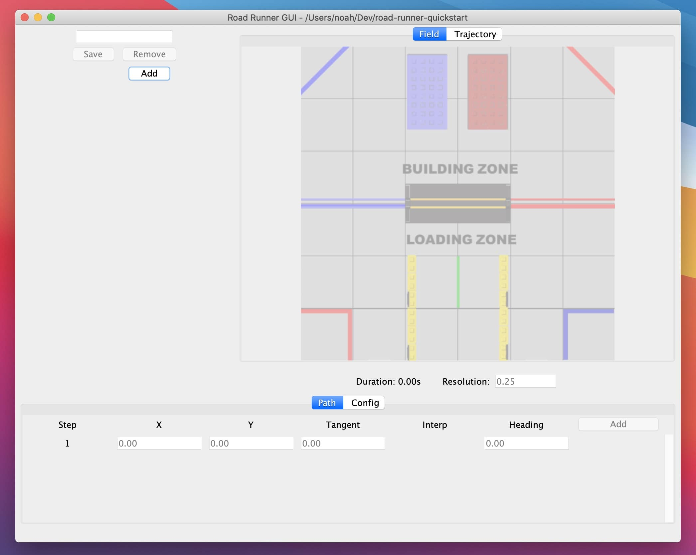

# Official Road Runner GUI

Road Runner comes with an official GUI plugin for designing trajectories. It is able to export trajectories to a yaml file which can be read by the Road Runner library.
However, the GUI can only build spline paths. It does not utilize `lineTo` or the relative movements (`strafe()`, `forward()`, etc). Because it is exported to a yaml file, it does not support markers.
If you do choose to use the official GUI, I would recommend using the trajectory builder and translating that to Java code yourself.

## Installation

1. Navigate to the [Road Runner latest release page on github](https://github.com/acmerobotics/road-runner/releases/tag/v0.5.6)
2. Scroll down to the assets dropdown and find `road-runner-gui-x.x.x.jar`
3. Click the fiele name to download the .jar.
4. Run the .jar file you just downloaded in a terminal:

```
java -jar road-runner-gui-x.x.x.jar
```

## Usage

1. Run the .jar file you downloaded
2. It will popup a small window that asks you to "select the location for your project"
3. Click the browser button and navigate to the folder with your FTC code
4. You should see the following window:

<figure align="center">
    
    <figcaption class="mt-2 text-gray-600 text-center">Main Window</figcaption>
</figure>

5. Click the add button (top left) and give your trajectory a name
6. Now, click the add button near the bottom right, this will add more waypoints
   - Edit the coordinates in your waypoints
7. Play around!

   - The interp dropdown allows you to change the heading interpolating type on each waypoint
   - The config tab allows you to change the physical properties and constraints of the bot

8. Hover over the field to see your bot animate through the trajectory
9. The save button will export your trajectory to a yaml file
