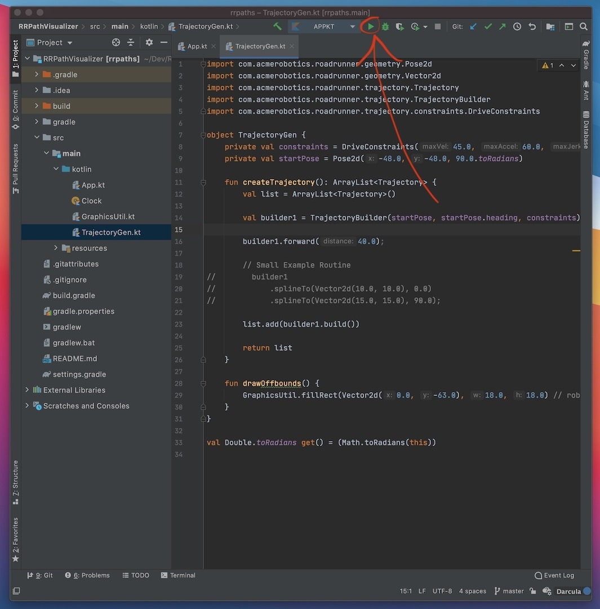

## RRPathVisualizer

RRPathVisualizer was written by David, Recharged Green 7236's lead programmer. It is a path "visualizer" in that you write your trajectories as you would for your bot and you stick them in a custom Kotlin project. If you run the program it will display a window and animate the bot along your specified trajectories. I personally prefer this workflow as you can simply copy-paste the trajectories you made in RRPathVisualizer into your own FTC project.

Keep in mind that RRPathVisualizer is written in Kotlin. It should be easy to understand Kotlin if you know Java.

## Installation

1. Install [Intellij](https://www.jetbrains.com/idea/)

   - Although the community edition is free, you can get the ultimate edition for free if you sign up with a [student account](https://www.jetbrains.com/community/education/#students)

2. Clone or download [RRPathVisualizer](https://github.com/RechargedGreen/RRPathVisualizer)
3. Open the project in Intellij

## Usage

1. Open the project in Intellij
   - Android Studio is very similar to Intellij so you should be familiar with the interface
2. You should just be able to press the play button up top without any problems

<figure align="center">
    
    <figcaption class="mt-2 text-gray-600 text-center">Peep the play button 👀</figcaption>
</figure>

3. You may have to set the project SDK
   - If so, go to the File > Project Structure
   - Find the "Project SDK" setting. Select the latest JDK version installed. Intellij should come bundled with JDK 14
4. To make your paths, open the `TrajectoryGen.kt` file
5. Ensure that the `driveConstraints` values matches the `DriveConstraints` you have in your own Road Runner setup on your bot
6. Ensure that the `trackWidth` value matches the `TRACK_WIDTH` value in your `DriveConstants.java` file. This ensures more accurate trajectory length estimates
7. Find `builder1`. The `builder1` object is the example `TrajectoryBuilder` provided. You are free to add more builders for more trajectories
8. Just use the builder as you would normally create trajectories
9. You can add more trajectories by calling `list.add(trajectory)`
10. **NOTE:** RRPathViz cannot simulate point turns.

## Note:

On your actual bot, each trajectory will have a 0.5s timeout after the bot is done following it. This is to allow for any correction with the translational and heading PID if your bot strays off the path. This timeout is cut short if your bot is able to reach the end of the trajectory without correction. Thus, each trajectory may have up to 0.5s added on to it. This extra time is not reflected in RRPathVisualizer's trajectory time estimate. Just be aware of this timeout when creating your trajectories. You are able to change the duration of this correction timeout in the quickstart. If you'd like to do so, change the last parameter, the one with the 0.5 value, where `follower` is set to `HolonomicPIDVAFollower` in `SampleMecanumDrive.java`.

## Resources

Video from Bots in Black, team 16633, explaining installation, basic troubleshooting, and basic usage of RRPathVisualizer:

   <iframe width="560" height="315" src="https://www.youtube.com/embed/70mOwbp6ANs" frameborder="0" allow="autoplay; encrypted-media" allowfullscreen></iframe>

