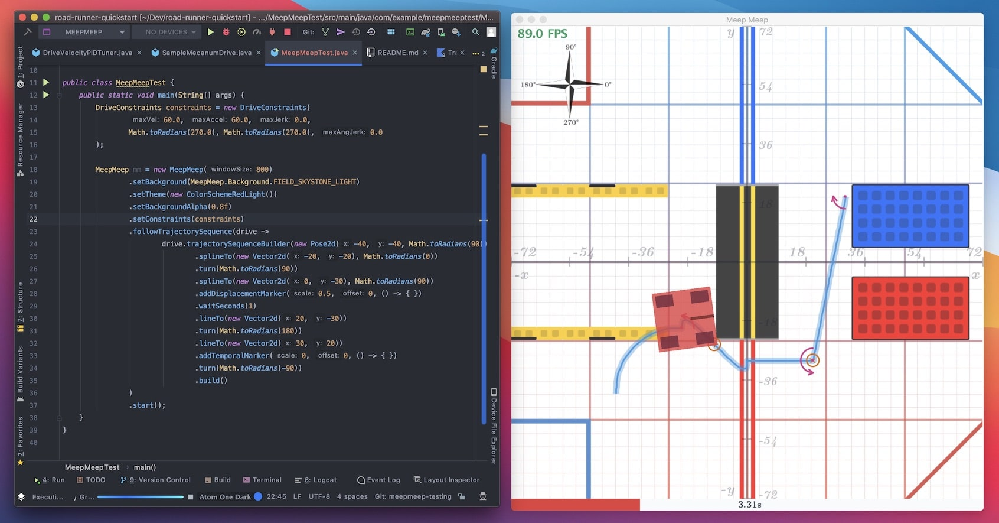
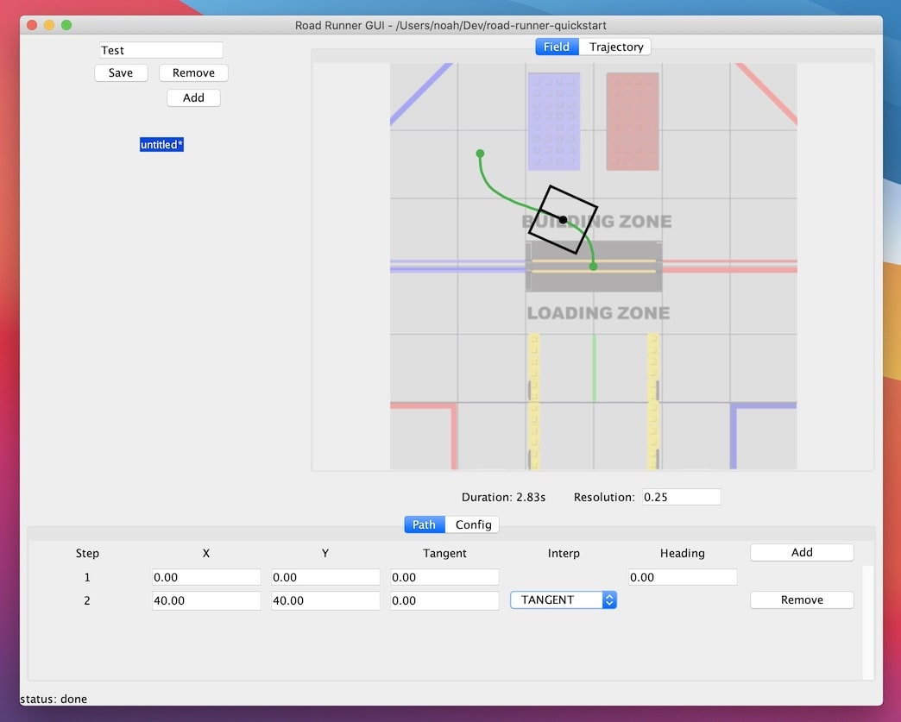
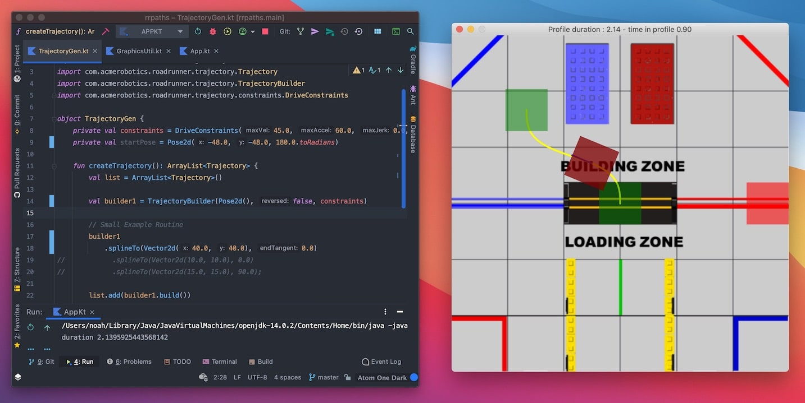

# Tools

## MeepMeep

<figure align="center">
    
    <figcaption class="mt-2 text-center text-gray-600">MeepMeep</figcaption>
</figure>

As of writing, MeepMeep is the most fully featured path visualizer for Road Runner. Although I am biased, as I wrote MeepMeep, it objectively supports the most features and is the only visualizer to support the trajectory sequence API and markers.

All the screenshots and gifs in LearnRoadRunner were generated using MeepMeep.

MeepMeep's cool features:

- Marker visualization
- Timeline scrubbing
- `TrajectorySequence` support
- Customizable gui
  - Can change field image, color schemes, etc.
  - Drag and drop trajectory builder (in development)
  - Dark mode color schemes!!
- Runs in Android Studio. Co-located with your existing season code
- Sane field coordinates

Check the [MeepMeep page](/tool/meepmeep) for further details on installation and use.

## Road Runner GUI

<figure align="center">
    
    <figcaption class="mt-2 text-center text-gray-600">Road Runner Official GUI</figcaption>
</figure>

Road Runner comes with an official GUI plugin for designing trajectories. It is able to export trajectories to a yaml file which can be read by the Road Runner library.
However, the GUI can only build spline paths. It does not utilize `lineTo` or the relative movements (`strafe()`, `forward()`, etc). Because it is exported to a yaml file, it does not support markers.
If you do choose to use the official GUI, I would recommend using the trajectory builder and translating that to Java code yourself.

Check the [Road Runner GUI page](/tool/road-runner-gui) for further details on installation and use.

## David's RRPathVisualizer

<figure align="center">
    
    <figcaption class="mt-2 text-center text-gray-600">David's RRPathVisualizer</figcaption>
</figure>

RRPathVisualizer was written by David, Recharged Green 7236's lead programmer. It is a path "visualizer" in that you write your trajectories as you would for your bot and you stick them in a custom Kotlin project. If you run the program it will display a window and animate the bot along your specified trajectories. I personally prefer this workflow as you can simply copy-paste the trajectories you made in RRPathVisualizer into your own FTC project.

Keep in mind that RRPathVisualizer is written in Kotlin. It should be easy to understand Kotlin if you know Java.

Check the [RRPathVisualizer page](/tool/rrpathvisualizer) for further details on installation and use.

### Note:

David's RRPathVisualizer and the official Road Runner GUI both utilize a rotated field coordinate system. Their entire field is rotated 90 degrees to match the audience's perspective. Because of this, the Y axis is horizontal and the X axis is vertical. The Y axis increases to the left and the X axis increases vertically. Just to clear any confusion when using both applications.

MeepMeep does not use a rotated field. Although the field is no longer displayed through the audience's perspective, the X and Y axis follow a typical cartesian coordinate map. Please see the [coordinate system specification](/trajectories.html#coordinate-system) for more details.

## RRPathGen

    <VideoDisplay src="./assets/tools/rrpathgen-half.mp4" width="500px" :controls="false"/>
    <figcaption class="mt-2 text-center text-gray-600">RRPathGen by 21511</figcaption>

RRPathGen is a program that allows teams to quickly generate paths through a GUI. Here are some of its features:
- Viewing of paths by importing them
- Modification of paths through either the GUI or changing the values in the text fields
- Export of paths in the form of Java code
- Customisation of length and width of the robot
- Support for different sized screens and resolutions
- Paths can be flipped to account for the robot starting in different sides of the field
- Uses same field coordinates as MeepMeep
- Support for TrajectorySequences coming soon

Check the [RRPathGen page](/tool/rrpathgen) for further details on installation and use.