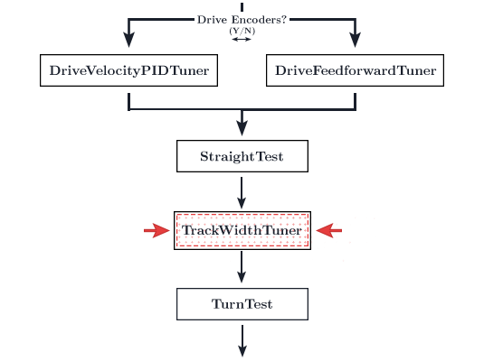
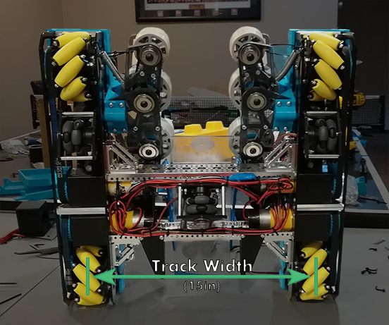

# Track Width Tuning

<figure align="center">
    
    <figcaption class="mt-2 text-gray-600 text-center">You are here</figcaption>
</figure>

::: warning
Your localizer's heading measurements should be accurate prior to tuning this. If you're using a 3-wheel localizer, this means tuning the lateral distance. Otherwise, the heading should come directly from the IMU.
:::

::: tip
This is a fairly verbose clarification of the term track width as its use in different contexts can be confusing.

Track width is simply the center-to-center distance from two parallel wheels. However, there are two types of track width that you may see.

The track width in your `DriveConstants.java` refers to the track width of the drive train.
However in the context of dead wheel odometry, track width is the center-to-center distance of the two parallel wheels. This only applies to three-wheel odometry. The track width for three-wheel odometry refers to the same thing as `LATERAL_DISTANCE`.
We are not touching the localizer at the moment, thus any references to track width on this page will refer to the drive train track width (located in `DriveConstants.java`).

The track width for the **drive train** is used for the forward kinematics for feedforward following.

The track width for **three-wheel odometry** (aka `LATERAL_DISTANCE`) is used for localization.

You should have already tuned localization. Right now, you will be tuning the drive train.
:::

1. Before you begin tuning the track width tuner, we're going to run a quick tuner that gives us the empirical max angular velocity value the bot is able to sustain. The track width tuner will not work properly if angular velocity is too high.
2. Run the `MaxAngularVelocityTuner` opmode. It will spin in a circle at maximum speed for the specified number of seconds. After it has completed its sequence, it will print a "Max Angular Velocity" value. Set the `MAX_ANG_VEL` field in your `DriveConstants.java` file to this value.
3. Run the `TrackWidthTuner` opmode.
4. Your bot should turn 180 degrees 5 times.
5. Don't touch the bot during the tuning process.
6. At the end of the tuning, the RC's telemetry should print an "effective track width".
7. If this number sounds reasonable (close to the actual physical track width, might be a few inches off), stick this number in your `DriveConstants.java` file under `TRACK_WIDTH`.
   - If you have FTC Dashboard open, you can change the track width in the variable configuration sidebar (on the right) to test your values. You may need to run the tuner a few times so this makes it a lot easier as you don't have to change the constants file and re-compile/re-upload the app to test values.
8. The bot should be turning close to 180 degrees every time once tuned.
9. If you bot runs into the following issues, you will have to tune manually:
   - It does not turn 180 degrees each time, even with tuning
   - The effective track width given does not print something reasonable (most likely a low number like 3)
     - This is generally caused by failing to put an initial estimate in the drive constants file and leaving the track width at `1`. However, the `TrackWidthTuner` seems to just run into ✨ issues ✨ sometimes. Manually tuning is completely fine and takes only a few minutes.
10. To tune the track width manually, simply keep adjusting the track width yourself until it turns 180 degrees. If the the bot turns less than 180 degrees, raise the trackwidth. If the bot turns more than 180 degrees, lower the trackwidth.
11. **NOTE:** The track width tuning doesn't need to be _exact_. Once you are within a degree or two (or even three!), it's okay to move on. This initial step uses a feedforward motion profile with no feedback-based correction. Once you enable the heading PID in the follower PID step, your turn steps should rotate to the exact desired angle.

::: tip

If you are having problems with the track width tuner, try reducing the `MAX_ANG_VEL` in your `DriveConstants.java` file. A track width that is unreasonable high will result in turning issues.

:::

<figure align="center">
    
    <figcaption class="mt-2 text-sm text-gray-600 text-center">3658 Bosons's 2019/20 Skystone Bot</figcaption>
</figure>
