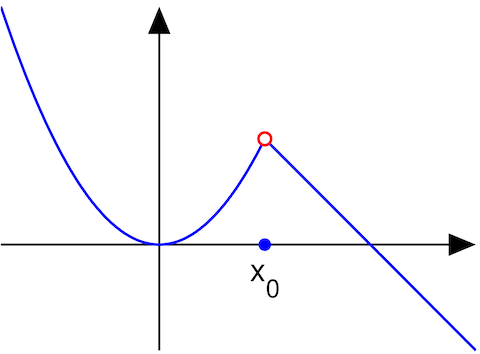
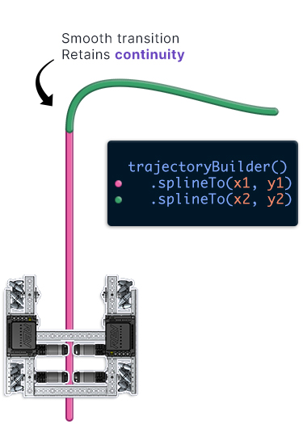
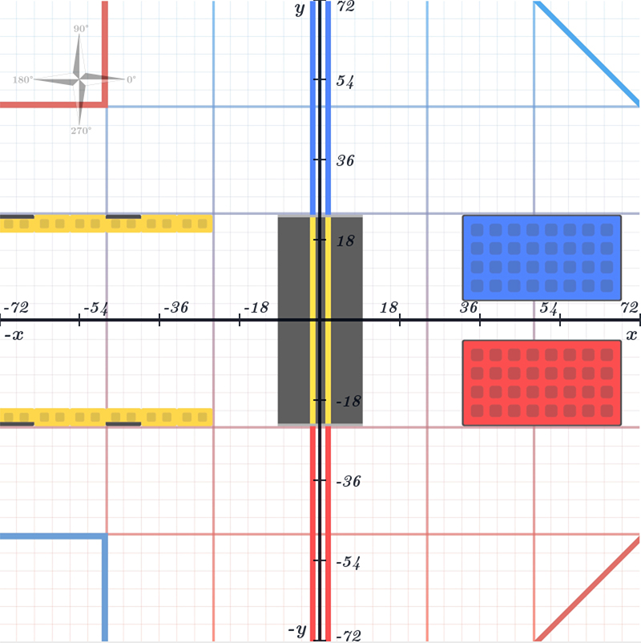

# Trajectories Overview

## Trajectories vs Paths

Just as a clarification, Road Runner has two types of data structures for constructing your routes: paths and trajectories. Paths are what one would expect them to be.
They simply hold the entire route built by the waypoints you define. These routes can be simple straight lines or smooth splines. Trajectories are paths with motion profiling.
This means that they also map what velocity your bot should be throughout the entire route. This allows one to control the acceleration, velocity, angular acceleration, etc.
As it is right now, Road Runner does not package a path follower for holonomic drive. It does include Ramsete path following for tank drive.
The addition of a holonomic guided vector field follower will allow for path following with holonomic drives.
Check out the [FTC Discord](https://discord.gg/first-tech-challenge) for further details on that.
Road Runner does include PIDVA trajectory followers for both holonomic and tank drive. This is what the quickstart utilizes by default.

## Vectors and Poses

Because you will be utilizing them quite a bit, we're going to define the two Road Runner classes used to represent position.

### Vector2d

Represents a 2d vector: an X and Y coordinate.

```java
// Create a vector at coordinate (10, -5)
Vector2d myVector = new Vector2d(10, -5);
```

### Pose2d

Represents a 2d robot pose: and X and Y coordinate, and a heading.

Generally, this represents the robot's position and direction it faces.
Remember that increasing the angle goes counter-clockwise, just like any unit circle you've learned about in trigonometry.
Keep this in mind as the turn function will go counter-clockwise.
Also remember that any representation of an angle should be in radians. This is why we use the `Math.toRadians()` function to convert from degrees to radians.

```java
// Create a pose at coordinate (10, -5) facing 90 degrees
Pose2d myPose = new Pose2d(10, -5, Math.toRadians(90));
```

## Building a Trajectory

We're going to assume you're using the road-runner-quickstart repo. If not, the gist of everything is still the same. You just have to ignore the `SampleMecanumDrive.java` helper functions.
It's quite trivial if you want to figure out how to use it without the quickstart if you choose to go your own route.

You may have already gotten the gist of how to write your own trajectory through the tuning opmodes. Here is a basic sample:

```java
public class MyOpmode extends LinearOpMode {
  @Override
  public void runOpMode() {
    SampleMecanumDrive drive = new SampleMecanumDrive(hardwareMap);

    Trajectory myTrajectory = drive.trajectoryBuilder(new Pose2d())
        .strafeRight(10)
        .forward(5)
        .build();

    waitForStart();

    if(isStopRequested()) return;

    drive.followTrajectory(myTrajectory);
  }
}
```

Let's go through this step by step.

<div class="h-5"></div>

```java
SampleMecanumDrive drive = new SampleMecanumDrive(hardwareMap);
```

There, we simply declare the `SampleMecanumDrive` object included in the quickstart and pass in the `hardwareMap` from the opmode.

<div class="h-5"></div>

```java{1}
Trajectory myTrajectory = drive.trajectoryBuilder(new Pose2d())
  .strafeRight(10)
  .forward(5)
  .build();
```

This is your main trajectory building interface. We create a `Trajectory` object named `myTrajectory`.
We do so by callling the `trajectoryBuilder()` function from `drive`. This just automatically passes in our constraints.

We pass in a starting pose: `new Pose2d()`. This is the same as doing `new Pose2d(0, 0, 0)`, so creating a pose at x: 0, y: 0, and heading: 0 degrees.

What we're saying is that we want to assume the bot starts at the center of the field facing straight (we'll discuss the coordinate system later).
If you want to set your starting position to something else, say x: 5, y: -4, at a 90 degree turn, you would replace `new Pose2d()` with `new Pose2d(5, -4, Math.toRadians(90))`.

Notice the lack of semicolon at the end of the `drive.trajectoryBuilder()` line. That means that line doesn't actually end there. The entire line is actually the same as this:

```java
Trajectory myTrajectory = drive.trajectoryBuilder(new Pose2d()).strafeRight(10).forward(5).build();
```

However, we prefer to enter a new line to keep everything clean.

<div class="h-5"></div>

```java{2,3}
Trajectory myTrajectory = drive.trajectoryBuilder(new Pose2d())
  .strafeRight(10)
  .forward(5)
  .build();
```

Next, notice the `.strafeRight(10)` and `.forward(5)` functions. We are telling the trajectory that we want to strafe right 10 inches, then go forward 5 inches.
The `TrajectoryBuilder` object utilizes something called a [builder pattern](https://howtodoinjava.com/design-patterns/creational/builder-pattern-in-java/) that allows us to [method chain](https://www.geeksforgeeks.org/method-chaining-in-java-with-examples/).
This means that we can keep chaining differents methods, infinitely, to keep building up our trajectory. Check out the [TrajectoryBuilder Function List](/trajectorybuilder-functions) for more options.

<div class="h-5"></div>

```java{4}
Trajectory myTrajectory = drive.trajectoryBuilder(new Pose2d())
  .strafeRight(10)
  .forward(5)
  .build();
```

Finally, take a look at the `build()` function. The `trajectoryBuilder()` function doesn't actually return a `Trajectory` object. It returns a `TrajectoryBuilder` object which allows us to do the fancy method chaining and builder pattern.
We turn that `TrajectoryBuilder` into a `Trajectory` by calling the `build()` function. This will run through everything you built, double check everything, validate the trajectory, and then return your built `Trajectory` object.

<div class="h-5"></div>

```java{5}
waitForStart();

if(isStopRequested()) return;

drive.followTrajectory(myTrajectory);
```

We're going to ignore the the first 3 lines as those are standard FTC Opmode procedures. Notice the `drive.followTrajectory(myTrajectory)` function. Essentially, we take our trajectory and tell our bot to follow it.
Pretty self explanatory. At that point, the bot will try to follow the entire trajectory.

<div class="h-5"></div>

That's it right? Well, not quite. if you run that trajectory as-is, it's actually going to break. It'll throw a `PathContinuityException` error. Learn more about those [below](#path-continuity-exception).

## Path Continuity Exception

So you go to run your cool new trajectory you just made.

```java
drive.trajectoryBuilder(new Pose2d())
  .strafeRight(10)
  .forward(5)
  .build();
```

Sadly, your program crashed and you run into a `PathContinuityException` error. Why is that??

Well, you've run into a continuity error. What does this mean? If you harken back to the old days of pre-calculus or algebra 2, you may have covered [discontinuities](https://www.wikiwand.com/en/Classification_of_discontinuities). If you haven't taken either of those classes yet, you will eventually cover them.

<figure align="center">
    <div class="relative rounded-lg overflow-hidden">
      
      <div class="absolute top-0 left-0 w-full h-full pointer-events-none" style="box-shadow: inset 0 2px 6px 2px rgba(0, 0, 0, 0.06)"></div>
    </div>
    <figcaption class="mt-2 text-sm text-gray-600 text-center">Removable Discontinuity</figcaption>
</figure>

Road Runner wants a continuous path for motion profiling purposes. This isn't just a Road Runner quirk. Any motion profiling system (FTCLib/WPILib) will want to enforce continuity.
When Road Runner throws that `PathContinuityException`, your path is no longer continuous. This means that it takes a sudden jump in velocity or position. This can only happen in cases of infinite velocity or acceleration, obviously not possible in the real world.
Motion profiling generates the exact path you need to take. Therefore, all the trajectories you create must follow the laws of physics and be continuous.

<figure align="center">
    
    <figcaption class="mt-2 text-gray-600 text-center">PathContinuityException Example</figcaption>
</figure>

When looking at the path above, your bot _physically cannot_ follow that exact path. Imagine the bot moving along that path in your head. It gets towards the edge the of pink line at full speed and it wants to suddenly strafe right.
However, it still has momentum upwards so it'll make an arc instead of making that exact right turn. Instantly strafing right would require an instanteous change in velocity. Even if you had rocket boosters on your bot, it would still make a _slight_ arc.
To follow that path exactly, it needs to decelerate, or slow down, towards the end of the pink path and come to a full stop to shed any forward momentum. Then, it is able to make that right strafe.

So what do we do? There are two options:

1. **Split your path into two separate trajectories**

```java
Trajectory traj1 = drive.trajectoryBuilder(new Pose2d())
  .strafeRight(10)
  .build();

Trajectory traj2 = drive.trajectoryBuilder(traj1.end())
  .forward(5)
  .build();

drive.followTrajectory(traj1);
drive.followTrajectory(traj2);
```

This method is completely viable and there is nothing wrong with it. However, it will decelerate at the end of each path. So your bot with first strafe right, slow down, stop, and then go forward. It will not smoothly transition from strafing right to going forward.
This takes longer as your bot will have to keep stopping and accelerating on each path. Check out the [Running Multiple Trajectories](#running-multiple-trajectories) section to ensure that you're doing this correctly.

2. **Use spline paths to retain continuity**

This is the more optimal method of creating multi-part paths. Spline paths allow you to retain continuity and smoothly transition into other movements.
The only quirk is that splines can make odd shapes if you don't understand how to use them correctly. It is highly recommended to run all your paths through a [path visualization tool](/tools).
Check out the [TrajectoryBuilder Function List](/trajectorybuilder-functions) to see all your options.

```java
Trajectory traj = drive.trajectoryBuilder(new Pose2d())
  .splineTo(new Vector2d(x1, y1), heading)
  .splineTo(new Vector2d(x2, y2), heading)
  .build();
```

<figure align="center">
    
    <figcaption class="mt-2 text-gray-600 text-center">Spline Goodness. CAD provided by Aman of 3916</figcaption>
</figure>

## Running Multiple Trajectories

Even if you are running spline paths to ensure continuous paths, you will eventually need to run a second trajectory. A trajectory represents a continuous movement and should end when your bot comes to a halt.
If your bot goes back and forth, each movement that the bot comes to halt or reverses direction should be its own trajectory.

**How to run multiple trajectories**:

```java
Trajectory traj1 = drive.trajectoryBuilder(new Pose2d())
  .strafeRight(10)
  .build();

Trajectory traj2 = drive.trajectoryBuilder(traj1.end())
  .splineTo(new Vector2d(5, 6), 0)
  .splineTo(new Vector2d(9, -10), 0)
  .build();

Trajectory traj3 = drive.trajectoryBuilder(traj2.end())
  .splineTo(new Vector2d(5, 6), 0)
  .splineTo(new Vector2d(9, -10), 0)
  .build();

drive.followTrajectory(traj1);
robot.dropServo();
drive.followTrajectory(traj2);
drive.followTrajectory(traj3);
```

There are a few things to notice here.

1. When making trajectories that call one after each other, the starting pose of the following trajectories should be the previous trajectory's `end()` value.
2. Generate all your trajectories before calling any of the `followTrajectory()` functions. Generating a trajectory takes like half a second and if you generate them on the fly you will notice a slight pause between your paths.
3. Notice the `robot.dropServo()` function. Each `drive.followTrajectory()` function is synchronous. This means that the opmode won't move on to the next line until that trajectory is done following. So `robot.dropServo()` will be called after the
   first trajectory is finished. Then it will follow the second trajectory after `robot.dropServo()` is finished. If you want to follow trajectories asynchronously, check the [advanced](/advanced#async-following) section for further details.

## Trajectories vs Turns

The `SampleMecaunmDrive.java` class provided by the quickstart supports a `turn()` function. However, this `turn()` function is actually not part of the Road Runner core itself. It is simple a turning motion profile generated in the `SampleMecanumDrive.java` class.
Thus, it can not be called in a trajectory. Treat it as a method similar to `followTrajectory()`.

```java
drive.followTrajectory(traj1);
drive.turn(Math.toRadians(90));
drive.followTrajectory(traj2);
drive.turn(Math.toRadians(-270));
```

## Going Backwards

Say you want to drive your robot in reverse. `TrajectoryBuilder` actually makes this quite simple.

```java{1}
Trajectory trajectory = drive.trajectoryBuilder(new Pose2d(), true)
  .splineTo(new Vector2d(36, 36), Math.toRadians(0))
  .build();
```

The `true` boolean in the second parameter indicates that you want the bot to follow the path in reverse.

<div class="flex items-center justify-center flex-col">
    <VideoDisplay src="./assets/trajectory-overview/reversed-demo.mp4" width="400px" :controls="false"/>
</div>

This is actually just a shorthand for passing a heading of 180 degrees into the second parameter.
The `TrajectoryBuilder` supports any arbitrary heading in the second parameter.

```java
Trajectory trajectory = new TrajectoryBuilder(new Pose2d(), Math.toRadians(90))
  .splineTo(new Vector2d(36, 36), Math.toRadians(0))
  .build();
```

The code above will tell your bot to follow the entire path at a 90 degree angle.

## Coordinate System

We're going to clarify the FTC coordinate system just because the official Road Runner GUI and David's RRPathVisualizer use a rotated field and it may be confusing.

The `0,0` origin of the field is at the center of the field.

The Red Alliance Station is used as the frame of reference as it is clearly defined upon every game.

The X axis extends through the origin and runs _parallel_ with the Red Alliance Station. The X axis value increases to the right.

The Y axis extends through the origin and runs _perpendicular_ to the Red Alliance Station. The axis value increases away from the Red Alliance Station.

<figure align="center">
    <div class="relative rounded-lg overflow-hidden">
      
      <div class="absolute top-0 left-0 w-full h-full pointer-events-none" style="box-shadow: inset 0 2px 6px 2px rgba(0, 0, 0, 0.06)"></div>
    </div>
    <figcaption class="mt-2 text-sm text-gray-600 text-center">2019/20 Skystone Field</figcaption>
</figure>

Notice how the field is rotated 90 degrees relative to if we were looking at it from the audience's point of view. This is because the frame of reference is defined by the Red Alliance Station. Be mindful of this as Road Runner's official GUI and RRPathVisualizer both opt for the "proper" orientation of the field. Thus, in their maps, Y increase to the left and X increases up.

Specifications for the official FTC coordinate system can be found [here](https://github.com/ftctechnh/ftc_app/files/989938/FTC_FieldCoordinateSystemDefinition.pdf)
