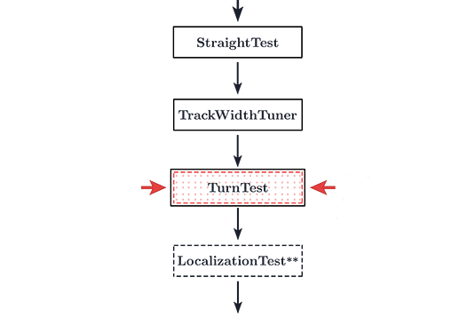

# Turn Test Tuning

<figure align="center">
    
    <figcaption class="mt-2 text-gray-600">You are here</figcaption>
</figure>

Turn test is just a check to ensure that your track width isn't waaay off.

1. Run the `TurnTest` opmode via the RC.
2. By default, your `TurnTest` should turn your bot 90 degrees.
3. The bot may not turn exactly 90 degrees. This may be due to some slight feedforward discrepancy.
4. If it doesn't, go to your `TurnTest.java` opmode in Android Studio. Change the `ANGLE` variable to 180 degrees.
5. Re-run the opmode. It should turn exactly 180 degrees if you tuned the track width properly.
6. If not, re-tune track width. Don't worry about the error at 90 degree turns. That will be fixed later once we tune the heading PID.
